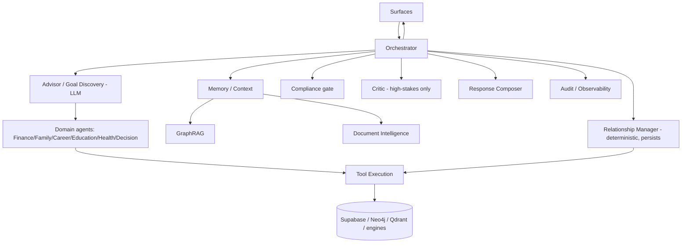
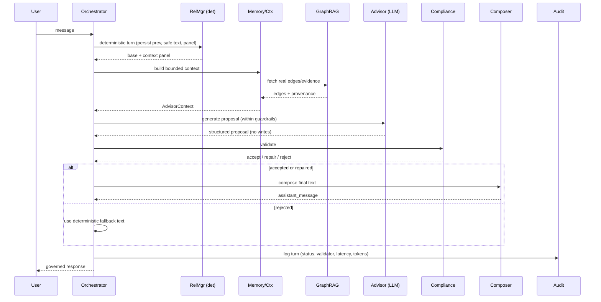

# LIOS — Agent Interaction Diagram

> How LIOS agents call, hand off to, escalate to, and gate one another. Companion to `LIOS_ARCHITECTURE.md`.
> Diagrams are both ASCII (always renders) and Mermaid (renders on GitHub). Architecture only — no code.

---

## 1. Topology (who may call whom)

The Orchestrator is the **only** agent allowed to sequence others. Leaf agents never call surfaces, never
call each other arbitrarily, and never call the persistence layer except through approved writers.

```
                         ┌──────────────┐
        surfaces ───────▶│ ORCHESTRATOR │◀─────── surfaces (response)
                         └──────┬───────┘
        ┌───────────────┬───────┼────────┬───────────────┬───────────────┐
        ▼               ▼       ▼        ▼               ▼               ▼
 ┌────────────┐  ┌───────────┐ │  ┌────────────┐  ┌────────────┐  ┌────────────┐
 │ Relationship│  │  Memory / │ │  │  Advisor / │  │ Compliance │  │   Audit /  │
 │  Manager    │  │  Context  │ │  │  Goal Disc.│  │  (gate)    │  │ Observ.    │
 │(determ.write)│ └─────┬─────┘ │  │  (LLM)     │  └─────┬──────┘  └────────────┘
 └─────┬──────┘        │       │  └─────┬──────┘        │
       │               ▼       │        │               ▼
       │        ┌────────────┐ │        │        ┌────────────┐
       │        │  GraphRAG  │ │        │        │   Critic    │ (high-stakes only)
       │        └─────┬──────┘ │        │        └─────┬──────┘
       │              ▼        │        │               ▼
       │        ┌────────────┐ │        │        ┌────────────┐
       │        │  Document  │ │        │        │  Response   │
       │        │  Intel.    │ │        │        │  Composer   │
       │        └────────────┘ │        │        └────────────┘
       ▼                       ▼        ▼
 ┌──────────────────────────────────────────────┐
 │ DOMAIN AGENTS  Finance·Family·Career·Education │
 │ ·Health·Decision Intelligence  (read context)  │
 └───────────────────────┬──────────────────────┘
                         ▼
               ┌──────────────────┐
               │  Tool Execution  │ (deterministic calc + approved writes)
               └────────┬─────────┘
                        ▼
   Supabase (truth+RLS) · Neo4j · Qdrant · engines · object store
```



**Read vs write edges:**

- Memory/Context, GraphRAG, Document Intelligence, Domain agents → **read-only** to the LLM (context).
- Relationship Manager, Recommendation engine (via Tool Execution), domain writers → **the only writers**.
- The LLM (Advisor/Goal Discovery/domain reasoning) has **no edge to the database.**

---

## 2. Sequence — one advisor/discovery turn (the live path)

```
User        Orchestrator   RelMgr(det)   Memory/Ctx   GraphRAG   Advisor(LLM)   Compliance   Composer   Audit
 │  message    │              │             │            │            │             │           │         │
 ├────────────▶│              │             │            │            │             │           │         │
 │             │ 1 det turn   │             │            │            │             │           │         │
 │             ├─────────────▶│ persist prev│            │            │             │           │         │
 │             │              │ + safe text │            │            │             │           │         │
 │             │◀─────────────┤ base+panel  │            │            │             │           │         │
 │             │ 2 build ctx  │             │            │            │             │           │         │
 │             ├──────────────┼────────────▶│ 2a edges   │            │             │           │         │
 │             │              │             ├───────────▶│            │             │           │         │
 │             │              │             │◀───────────┤ real edges │             │           │         │
 │             │◀─────────────┼─────────────┤ AdvisorCtx │            │             │           │         │
 │             │ 3 plan/constraints (deterministic)       │            │             │           │         │
 │             │ 4 generate   │             │            │            │             │           │         │
 │             ├──────────────┼─────────────┼────────────┼───────────▶│ proposal    │           │         │
 │             │◀─────────────┼─────────────┼────────────┼────────────┤ (JSON)      │           │         │
 │             │ 5 gate       │             │            │            │             │           │         │
 │             ├──────────────┼─────────────┼────────────┼────────────┼────────────▶│ accept/   │         │
 │             │◀─────────────┼─────────────┼────────────┼────────────┼─────────────┤ repair/   │         │
 │             │              │             │            │            │             │ reject    │         │
 │             │ 6 compose (if accepted/repaired)         │            │             │           │         │
 │             ├──────────────┼─────────────┼────────────┼────────────┼─────────────┼──────────▶│ text    │
 │             │◀─────────────┼─────────────┼────────────┼────────────┼─────────────┼───────────┤         │
 │             │ 7 log turn   │             │            │            │             │           │         │
 │             ├──────────────┼─────────────┼────────────┼────────────┼─────────────┼───────────┼────────▶│
 │◀────────────┤ governed response                                                              │         │
```

Key ordering guarantees:

- **Deterministic-first (step 1).** The safe response exists before the LLM runs. If anything after step 1
  fails, the user still gets a correct, safe reply.
- **Context is read-only (steps 2–2a).** The LLM only ever sees the bounded `AdvisorContext`.
- **Gate is mandatory (step 5).** No LLM text reaches the Composer without passing Compliance.
- **Compose only merges text (step 6).** Structured/persisted outcomes are the deterministic ones.

### Streaming variant (live `converse_stream`)

```
User ──▶ Orchestrator ──▶ RelMgr (det turn)
            │  emit ACK  (deterministic safe text, ~1s)  ──────────────▶ User (first paint)
            │  ...Memory/Ctx → Advisor(LLM) → Compliance → Composer...
            │  emit FINAL (validated answer, ~when ready) ─────────────▶ User (replaces ack)
            └─ log turn → Audit
```

The ACK is the trust-safe deterministic text (the same text we'd show on fallback), so streaming never
shows unvalidated LLM content.



---

## 3. Sequence — a domain question (e.g. "How am I doing on retirement?")

```
User ─▶ Orchestrator
         │ classify intent = domain:finance/retirement
         ├─▶ Memory/Context (+ GraphRAG, Document Intel for 401k docs)
         ├─▶ Finance Domain Agent ──▶ Tool Execution (retirement projection, deterministic)
         │        │                         └─▶ returns numbers + calculation_trace
         │        └─▶ Recommendation engine (evidence-or-nothing) → cited recs or none
         ├─▶ LLM explains the domain summary (gated, no new numbers)
         ├─▶ Compliance gate (no advice; numbers must be from the projection/data)
         ├─▶ Response Composer
         └─▶ Audit ─▶ governed response (state + cited recs + missing inputs + provenance)
```

The LLM may _explain_ the deterministic projection; it may not _produce_ a different number. Every figure
traces to Tool Execution's `calculation_trace` or the user's data.

---

## 4. Sequence — document upload → truth

```
User uploads doc ─▶ Orchestrator ─▶ Document Intelligence
   ├─ classify type (26-type taxonomy)
   ├─ extract fields (LLM extraction, gated) → confidence per field
   ├─ write Document/DocumentField graph nodes (provenance → source doc)   [Tool Execution]
   └─ emit candidate facts to the User Truth Layer (provenance = on-record/document)
        └─ surfaced to the user for confirmation (becomes user_confirmed only on confirm)
```

Extracted facts enter as **proposals**, never as user-confirmed truth, until the user confirms (see
`TRUTH_AND_PROVENANCE_MODEL.md`).

---

## 5. Handoff rules

| From           | To                                        | When                         | What is passed                   |
| -------------- | ----------------------------------------- | ---------------------------- | -------------------------------- |
| Orchestrator   | Relationship Manager                      | every discovery turn, first  | message, pending key, user ctx   |
| Orchestrator   | Memory/Context                            | after the deterministic turn | base + user ctx                  |
| Memory/Context | GraphRAG / Document Intel                 | needs edges/evidence         | query + user_id                  |
| Orchestrator   | Advisor / domain LLM                      | context ready                | bounded context + plan + schema  |
| Advisor        | (proposes) Goal Discovery / Goal Conflict | goals present                | candidate goals, graph pairs     |
| Orchestrator   | Compliance                                | after every LLM output       | proposal + context               |
| Compliance     | Critic                                    | high-stakes + accepted       | validated proposal + evidence    |
| Orchestrator   | Response Composer                         | accepted/repaired            | safe proposal + base             |
| Orchestrator   | Audit                                     | end of every turn            | telemetry envelope               |
| any writer     | Tool Execution                            | confirmed write              | typed write request + provenance |

Handoffs carry **only** typed, bounded payloads. No agent forwards raw DB rows or secrets to an LLM agent.

---

## 6. Escalation & failure paths (never a broken or unsafe response)

```
LLM unavailable / unparseable ──▶ fallback:unavailable ──▶ deterministic safe text
LLM output fails Compliance ─────▶ fallback:<reason>    ──▶ deterministic safe text
Compose empty ───────────────────▶ fallback:empty       ──▶ deterministic safe text
Any unhandled exception ─────────▶ fallback:error       ──▶ deterministic safe text
Critic refutes high-stakes claim ▶ drop claim           ──▶ lower-confidence safe response + Audit flag
GraphRAG empty ──────────────────▶ no relationship claims (abstain)
Domain data insufficient ────────▶ honest empty state + missing-data list (no guess)
Persistence (audit) write fails ─▶ swallow (non-blocking); logging still records the turn
Tool precondition fails ─────────▶ typed error to caller; never a partial/silent write
```

**Invariant:** every failure degrades to a _safe, truthful_ response — never an exception to the user, never
an unvalidated LLM claim, never a fabricated value.

---

## 7. Confidence propagation

- Leaf agents emit confidence (Advisor per-turn; Goal Discovery per-candidate; domains per-summary/rec;
  GraphRAG per-edge; Document Intel per-field).
- The Orchestrator records confidence in the turn telemetry; the Critic can down-weight it.
- Low confidence changes _behavior_: ask a clarifying question instead of asserting; show a candidate fact
  instead of a confirmed one; surface an honest "insufficient" instead of a guess.
- Confidence is **never** invented to make a claim look stronger; it is sourced from provenance and the
  deterministic engines.

---

## 8. What is live vs planned in the interactions

- **Live:** the full discovery turn (steps 1–7), streaming ack/final, the Compliance gate, Audit logging,
  GraphRAG read into context, domain summary reads, document → truth pipeline.
- **Planned:** the Critic stage, explicit Goal Conflict detection as its own agent, and the Orchestrator's
  multi-domain intent routing (today the orchestrator is discovery-scoped).
