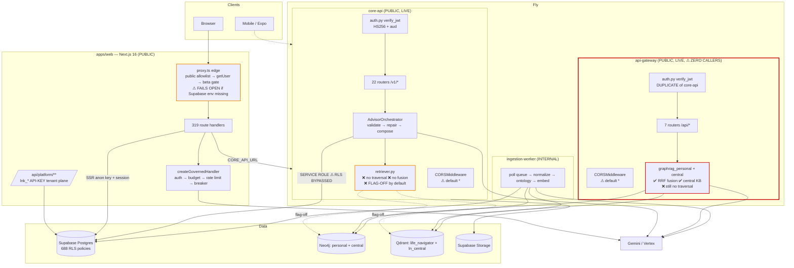
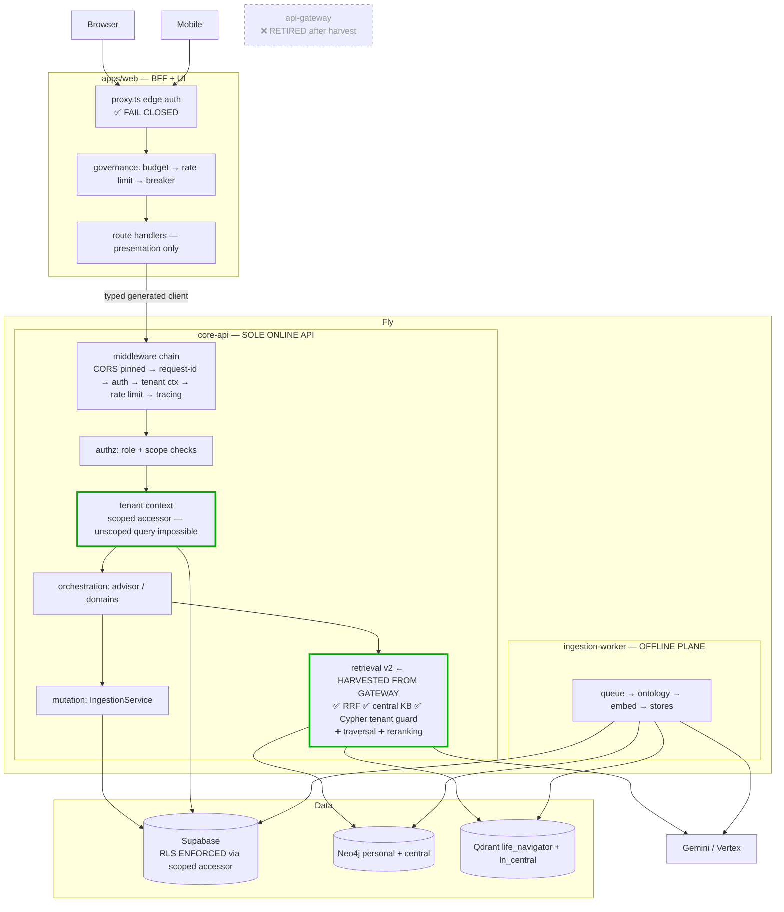

# API Runtime & Service-Ownership Map — LifeNavigator

**Date:** 2026-07-29 · **Phase:** audit only, no code changed
**Method:** source inspection of every entry point, router registration, and auth dependency; live HTTP
probes of both deployed Python services; CI/deployment configuration reading.

---

## 0. Headline Findings

**F-1. There are four request-receiving surfaces, not three.** Web (Next.js), core-api, api-gateway, plus a
distinct **API-key tenant plane** inside web (`/api/platform/**`, `lnk_*` keys) that uses a _different
identity model_ from everything else.

**F-2. `apps/api-gateway` is LIVE, internet-reachable, enforcing auth — and has ZERO callers.**

```
GET  https://lifenavigator-api-gateway.fly.dev/healthz            → 200 {"status":"ok"}
POST https://lifenavigator-api-gateway.fly.dev/api/graphrag/query → 401  (auth enforced, service running)
```

No source file in `apps/web`, `apps/lifenavigator-core-api`, or `apps/mobile` references its hostname. The
only references are in `docs/archive/`. It is a **running, orphaned, credential-holding attack surface**.

**F-3. The archived docs explain why.** `docs/archive/SOURCE_OF_TRUTH_VERIFICATION.md:15` records:

> "Prod web → API: `https://lifenavigator-api-gateway.fly.dev` (web calls **api-gateway**, not core-api)"

The gateway _was_ the system of entry. Web now points at `CORE_API_URL || https://lifenavigator-core-api.fly.dev`
(`apps/web/src/app/api/life/_helper.ts:2-3`). **The tier was superseded and never retired.**

**F-4 — CORRECTION TO PRIOR REPORTS. The better GraphRAG implementation is in the tier nothing calls.**
`AI_SYSTEMS_REVIEW.md` stated there is "no fusion, no RRF, no reranking" anywhere. That is true of
**core-api**. It is **false of api-gateway**, which implements:

- **Reciprocal Rank Fusion** (`graphrag_personal.py::rrf_fuse`, k=60) over vector + graph channels
- **Central (shared) knowledge retrieval** — a second Qdrant collection `ln_central` and a second Neo4j
  database `central`, neither of which core-api knows exists
- **Recency ordering** (`ORDER BY coalesce(n.updated_at, n.created_at) DESC`)
- **A tenant guard in the Neo4j helper** that refuses Cypher lacking `$tenant_id`

core-api's retriever has none of these, and is disabled by default. **The capability the product claims
exists — in the service the product does not call.**

**F-5. Neither Python tier traverses the graph.** Both run `MATCH (n) WHERE n.tenant_id = $x ... LIMIT $k`.
The gateway ranks and fuses better, but it is still a filtered node scan. The GraphRAG-is-not-GraphRAG
finding stands for both tiers.

**F-6. Edge auth fails open.** `apps/web/src/proxy.ts:65-68`: if `NEXT_PUBLIC_SUPABASE_URL`/`ANON_KEY` are
absent, **all requests pass through unauthenticated**. Mitigated because core-api independently verifies the
JWT — defense-in-depth holds — but the edge control is not trustworthy in isolation.

**F-7. CORS defaults to `*` with `allow_credentials=True` in BOTH Python tiers**
(`core-api/app/config.py`, `api-gateway/app/config.py`: `allowed_origins: str = "*"`). This resolves
open question **U-1** from the remediation plan as a **confirmed finding**.

---

## 1. Service Inventory

### 1.1 `apps/web` — Next.js application (BFF + UI)

| Attribute                     | Value                                                                                                                                                                                          |
| ----------------------------- | ---------------------------------------------------------------------------------------------------------------------------------------------------------------------------------------------- |
| **Language / framework**      | TypeScript / Next.js **16.2.6** (App Router)                                                                                                                                                   |
| **Entry point**               | `apps/web/src/proxy.ts` (Next 16's `middleware.ts` successor) → route handlers                                                                                                                 |
| **Deployment target**         | Vercel (Git integration, not the Fly workflow)                                                                                                                                                 |
| **Exposure**                  | **PUBLIC** — the user-facing origin                                                                                                                                                            |
| **Registered routers**        | 319 `route.ts` handlers; 189 pages                                                                                                                                                             |
| **Middleware order**          | 1. `proxy.ts` (public-route allowlist → Supabase `getUser()` → beta-access gate → onboarding redirects) 2. per-route handler 3. `createGovernedHandler` on AI routes                           |
| **Authentication**            | Supabase SSR cookie session (`supabase.auth.getUser()`). **Second model:** `lnk_*` API keys on `/api/platform/**` via `lib/tenant/api-gateway.ts` (sha256 hash compare, status + expiry check) |
| **Authorization**             | Route-level: public allowlist, private-beta gate, onboarding-state gates. API-key scopes on the platform plane                                                                                 |
| **Tenant derivation**         | Session user id (cookie) **or** `tenant_id` resolved from the API key — **two different tenant notions**                                                                                       |
| **Request validation**        | Ad hoc per handler; `send-server.ts` casts `Record<string, unknown>` and hand-validates                                                                                                        |
| **Response validation**       | Manual re-filtering of core-api responses (e.g. `sources` http(s) allowlist)                                                                                                                   |
| **Rate limiting**             | **Yes** — `governed-route.ts`: budget evaluation → rate limiter → circuit breaker, before any model call. CI-enforced by `verify-governance`                                                   |
| **Logging / tracing**         | `console.log('advisor_turn_reliability ' + JSON.stringify(...))`. No tracing                                                                                                                   |
| **Health / readiness**        | Vercel platform default                                                                                                                                                                        |
| **Downstream**                | core-api (`CORE_API_URL`), Supabase (direct, SSR client), Supabase Edge Functions                                                                                                              |
| **Datastore access**          | Supabase via anon key + user session (**RLS enforced here**)                                                                                                                                   |
| **Model access**              | Yes — some routes call models directly through the governance factory                                                                                                                          |
| **GraphRAG responsibilities** | None directly; consumes core-api output                                                                                                                                                        |
| **Persistent mutation**       | Yes — chat threads, profile, platform tenant records                                                                                                                                           |
| **Background jobs**           | No                                                                                                                                                                                             |
| **Actively deployed**         | **Yes**                                                                                                                                                                                        |
| **Code reachable**            | **Yes**                                                                                                                                                                                        |
| **Classification**            | **AUTHORITATIVE** for user-facing traffic; **BFF** in practice                                                                                                                                 |

### 1.2 `apps/lifenavigator-core-api` — FastAPI orchestration tier

| Attribute                     | Value                                                                                                                                                                                                                                                                                                                                                                     |
| ----------------------------- | ------------------------------------------------------------------------------------------------------------------------------------------------------------------------------------------------------------------------------------------------------------------------------------------------------------------------------------------------------------------------- |
| **Language / framework**      | Python 3.12 / FastAPI                                                                                                                                                                                                                                                                                                                                                     |
| **Entry point**               | `app/main.py::create_app()` → `app = create_app()`                                                                                                                                                                                                                                                                                                                        |
| **Deployment target**         | Fly.io `lifenavigator-core-api`, region `iad`, 1×shared-CPU / 512 MB, `min_machines_running=1`, `auto_stop_machines="suspend"`                                                                                                                                                                                                                                            |
| **Exposure**                  | **PUBLIC** — `https://lifenavigator-core-api.fly.dev` (verified 200)                                                                                                                                                                                                                                                                                                      |
| **Registered routers**        | 22, all under `/v1/*`: `/v1/life`, `/v1/finance`, `/v1/finance/plaid`, `/v1/health`, `/v1/career`, `/v1/education`, `/v1/family`, `/v1/decision`, `/v1/documents`, `/v1/reports`, `/v1/readiness`, `/v1/share`, `/v1/recommendations`, `/v1/benefits`, `/v1/military`, `/v1/platform`, `/v1/tools`, `/v1/life-graph`, `/v1/chat`, `/v1` (analytics, life-profile), health |
| **Middleware order**          | 1. `CORSMiddleware` (**only** middleware) 2. route dependencies (`Depends(authenticated)`) 3. handler. **No auth middleware — auth is per-route dependency**                                                                                                                                                                                                              |
| **Authentication**            | `app/auth.py::verify_jwt` — HS256 pinned, `audience="authenticated"`, `require:["exp","sub"]`. Correct                                                                                                                                                                                                                                                                    |
| **Authorization**             | **None beyond authentication.** `role` claim captured, never consulted. No RBAC                                                                                                                                                                                                                                                                                           |
| **Tenant derivation**         | `sub` claim → `UserContext.user_id`. Never from body — correct                                                                                                                                                                                                                                                                                                            |
| **Request validation**        | Pydantic models + `Body(embed=True)`                                                                                                                                                                                                                                                                                                                                      |
| **Response validation**       | Domain-level; advisor output additionally gated by `advisor_validator.validate()`                                                                                                                                                                                                                                                                                         |
| **Rate limiting**             | **NONE** (confirmed: no `rate_limit`/`RateLimit` symbols)                                                                                                                                                                                                                                                                                                                 |
| **Logging / tracing**         | Structured JSON to stdout; `analytics.advisor_turns` best-effort insert. No tracing                                                                                                                                                                                                                                                                                       |
| **Health / readiness**        | `/healthz` → 200 (Fly check: 15s interval, 2s timeout, 5s grace)                                                                                                                                                                                                                                                                                                          |
| **Downstream**                | Supabase (PostgREST + Storage), Neo4j, Qdrant, Gemini/Vertex, Plaid                                                                                                                                                                                                                                                                                                       |
| **Datastore access**          | **SERVICE-ROLE by default** — 117 `.select(` sites, 0 pass a user JWT. **RLS bypassed**                                                                                                                                                                                                                                                                                   |
| **Model access**              | **Yes — primary.** Gemini (AI Studio), Vertex Claude (flag-off), fast tier                                                                                                                                                                                                                                                                                                |
| **GraphRAG responsibilities** | `grounding/retriever.py` — vector + flat node scan, **no fusion, no traversal**, `GRAPH_GROUNDING_ENABLED` defaults **false**                                                                                                                                                                                                                                             |
| **Persistent mutation**       | **Yes — authoritative.** `IngestionService`, `life.facts`, domain writes, `advisor_turns`                                                                                                                                                                                                                                                                                 |
| **Background jobs**           | Fire-and-forget asyncio tasks (`_PENDING_WRITES`) for telemetry                                                                                                                                                                                                                                                                                                           |
| **Actively deployed**         | **Yes** (verified)                                                                                                                                                                                                                                                                                                                                                        |
| **Code reachable**            | **Yes** — web calls it                                                                                                                                                                                                                                                                                                                                                    |
| **Classification**            | **AUTHORITATIVE** orchestration + mutation tier                                                                                                                                                                                                                                                                                                                           |

### 1.3 `apps/api-gateway` — FastAPI retrieval service ⚠️

| Attribute                     | Value                                                                                                                                                                                                                             |
| ----------------------------- | --------------------------------------------------------------------------------------------------------------------------------------------------------------------------------------------------------------------------------- |
| **Language / framework**      | Python 3.12 / FastAPI, 1,508 LOC, 6 test files                                                                                                                                                                                    |
| **Entry point**               | `app/main.py::create_app()`                                                                                                                                                                                                       |
| **Deployment target**         | Fly.io `lifenavigator-api-gateway`, `iad`, 1×shared / 512 MB, `min_machines_running=1`, `auto_stop_machines="stop"`                                                                                                               |
| **Exposure**                  | **PUBLIC** — verified live: `/healthz` 200, `/api/graphrag/query` 401                                                                                                                                                             |
| **Registered routers**        | 7 under `/api/*`: `graphrag`, `recommendations`, `simulations`, `optimizer`, `compliance`, `arcana`, `health-monitoring`                                                                                                          |
| **Middleware order**          | 1. `CORSMiddleware` 2. route dependencies 3. handler. Identical shape to core-api                                                                                                                                                 |
| **Authentication**            | `app/auth.py::verify_jwt` — **functionally identical duplicate** of core-api's (HS256, same audience, same required claims)                                                                                                       |
| **Authorization**             | None beyond authentication                                                                                                                                                                                                        |
| **Tenant derivation**         | `sub` → `AuthenticatedUser.user_id`. Docstring: _"routes must never accept a `user_id` from the request body"_ — correct, and stronger: `retrieve_personal` **requires** `user_id` as a keyword arg so omission is a static error |
| **Request validation**        | Pydantic (`QueryRequest`, `QueryBody`)                                                                                                                                                                                            |
| **Response validation**       | Pydantic `response_model=QueryResponse` — **stricter than core-api**, which returns raw dicts                                                                                                                                     |
| **Rate limiting**             | **NONE**                                                                                                                                                                                                                          |
| **Logging / tracing**         | JSON stdout only                                                                                                                                                                                                                  |
| **Health / readiness**        | `/healthz` **and** `/readyz` (core-api has no `/readyz`)                                                                                                                                                                          |
| **Downstream**                | Gemini, Qdrant (personal + **central**), Neo4j (personal + **central** DB)                                                                                                                                                        |
| **Datastore access**          | Holds `supabase_service_role_key` in settings; Neo4j + Qdrant credentials                                                                                                                                                         |
| **Model access**              | Gemini embeddings + generation                                                                                                                                                                                                    |
| **GraphRAG responsibilities** | **The most complete implementation in the repo** — personal + central retrieval with **RRF fusion**                                                                                                                               |
| **Persistent mutation**       | **None found** — read/compute only                                                                                                                                                                                                |
| **Background jobs**           | None                                                                                                                                                                                                                              |
| **Actively deployed**         | **Yes — running and billed**                                                                                                                                                                                                      |
| **Code reachable**            | **NO — zero callers in any application source**                                                                                                                                                                                   |
| **Classification**            | **LEGACY / ORPHANED.** Formerly the system of entry; superseded by core-api; still deployed                                                                                                                                       |

### 1.4 `apps/ingestion-worker` — Rust ingestion plane

| Attribute           | Value                                                                                                                   |
| ------------------- | ----------------------------------------------------------------------------------------------------------------------- |
| **Language**        | Rust, 5,726 LOC                                                                                                         |
| **Entry point**     | `src/main.rs` — polling loop, **no HTTP ingress**                                                                       |
| **Deployment**      | Fly `lifenavigator-ingestion-worker`, 1×shared / 512 MB                                                                 |
| **Exposure**        | **INTERNAL** — cannot receive user requests                                                                             |
| **Auth / tenant**   | N/A; tenant carried on queue rows. Ontology registry guarantees no cross-tenant edge by construction                    |
| **Downstream**      | Supabase (queue + source rows), Gemini (embeddings), Neo4j, Qdrant                                                      |
| **Mutation**        | **Yes — writes the graph and vector stores**                                                                            |
| **Background jobs** | **This is the background-job plane** (`WORKER_POLL_INTERVAL_SECONDS=5`, `WORKER_BATCH_SIZE=25`, `WORKER_MAX_RETRIES=5`) |
| **Classification**  | **AUTHORITATIVE ingestion plane.** Correctly separated                                                                  |

### 1.5 Supabase (managed) — auth + data + edge functions

Issues the JWTs all tiers verify; enforces RLS for browser/anon paths; hosts Edge Functions (e.g.
`graphrag-query`, per repo) deployed from `ci.yml`. **A fifth compute surface** not audited in depth here.

---

## 2. Current Architecture



---

## 3. Request Traces

Legend: ✅ verified in source · ⚠️ partially verified · ❌ path does not exist / disabled

### T1 — Authentication & session establishment ✅

```
Browser → /auth/login (PUBLIC per proxy.ts allowlist)
  → Supabase Auth (GoTrue) issues HS256 JWT (aud=authenticated)
  → @supabase/ssr sets session cookies
  → subsequent request → proxy.ts → supabase.auth.getUser()
      ├─ env missing  → ⚠ ALLOW ALL (fail-open, proxy.ts:65-68)
      ├─ no user + protected page → 302 /auth/login
      └─ no user + protected API  → 401 JSON (deliberate: avoids a fetch() seeing login HTML as 200)
  → private-beta gate → onboarding-state gates → handler
```

**Tenant identity origin:** Supabase session cookie → JWT `sub`.

### T2 — Ordinary advisor query ✅

```
Browser → POST /api/chat/send (web)
  → proxy.ts (authenticated)
  → send-server.ts → POST {CORE_API}/v1/life/advisor/chat  [Bearer user JWT]
  → core-api CORSMiddleware → Depends(authenticated) → auth.py::verify_jwt (HS256, aud)
  → routers/life.py::advisor_chat (mode="advisor")
  → AdvisorOrchestrator.converse
      → _route (fast | standard | supervised)
      → AdvisorContextBuilder.build → Supabase reads [SERVICE ROLE — RLS bypassed]
         └─ graph_evidence = [] ❌ (GRAPH_GROUNDING_ENABLED=false)
      → LLM.generate (Gemini) → validate() → repair loop (≤1) → redact salvage → _compose
      → best-effort insert analytics.advisor_turns
  → web re-filters response (sources http(s) allowlist) → AdvisorMessage renders
```

**Note:** no rate limiting on the core-api hop; the governance layer is only on web-originated model calls.

### T3 — GraphRAG query ⚠️ **two divergent paths, one dead**

```
PATH A (product path, core-api):
  … /v1/life/advisor/chat → AdvisorContextBuilder
      → if GRAPH_GROUNDING_ENABLED (DEFAULT FALSE) → Retriever.retrieve_personal
          → Gemini.embed → Qdrant.search_personal
          → Neo4j: MATCH (n {tenant_id}) … LIMIT $k   ❌ no traversal
          → evidence = concat(vector, graph)           ❌ no fusion, graph score=None
      → TODAY: returns [] on every turn ❌

PATH B (gateway path, LIVE, ZERO CALLERS):
  Client → POST /api/graphrag/query [Bearer JWT]
      → verify_jwt → retrieve_personal(user_id=JWT.sub, …)
          → Gemini.embed → Qdrant.search_personal (tenant-filtered)
          → Neo4j run_personal (helper REFUSES cypher lacking $tenant_id) ✅
          → rrf_fuse(vector, graph, k=60) ✅
      → if include_central: retrieve_central → Qdrant ln_central ✅
      → QueryResponse{user_id, personal_hits, central_hits, fused} (response_model validated) ✅
```

### T4 — Personal-fact retrieval ✅

```
core-api → AdvisorContextBuilder → Supabase life.facts + domain tables [SERVICE ROLE]
  → domain_facts carry sourceTable/recordId/confidence
  → validator enforces citation VALUE MATCH (model cannot fake a source)
```

### T5 — Central-knowledge retrieval ⚠️ **exists only in the orphaned tier**

```
api-gateway → retrieve_central → Gemini.embed → Qdrant collection "ln_central"
  (config also declares neo4j_central_database="central")
core-api: ❌ no central concept at all
```

**This capability is unreachable from the product today.**

### T6 — File ingestion ✅

```
Browser → web → POST {CORE_API}/v1/documents/upload [Bearer JWT]
  → verify_jwt → documents router → services/documents.py
  → Supabase Storage upload [SERVICE ROLE] + documents schema row
  → enqueue → ingestion-worker (poll, batch 25)
      → normalize → ontology registry (78 edge rules) → Gemini.embed(summary)
      → Neo4j MERGE (tenant-safe by construction) + Qdrant upsert
```

⚠️ **No chunking** — one embedding per entity summary.

### T7 — Document OCR ⚠️

```
POST /v1/documents (create) / /v1/documents/upload
  → parser/extractor → page/section/char-span provenance + confidence bands
  → fields surface via /v1/documents/{id}/evidence
  → human review loop: POST /v1/documents/fields/{field_id}/review (confirm/edit/reject)
```

⚠️ Extracted text reaches advisor context **with no injection screening** (SECURITY_AUDIT HIGH-2).

### T8 — Persistent fact proposal ✅

```
advisor turn → LLM proposes candidate_facts / candidate_goals
  → validate() forces should_persist=False ALWAYS
  → candidate_facts filtered to source=="user_message"
  → confirmed_facts must match domain_facts BY VALUE
  → returned as PROPOSALS; nothing written
```

**The LLM cannot write. Correct and well-enforced.**

### T9 — Persistent fact approval ✅

```
Browser → POST {CORE_API}/v1/life/advisor/action/detect  → candidate actions
Browser → POST {CORE_API}/v1/life/advisor/action/apply   → approval-gated
  → verify_jwt → advisor_actions → IngestionService.write (life.facts) [SERVICE ROLE]
  → provenance recorded; refresh on next read
```

⚠️ Reachable from injected document content — the privileged sink identified in HIGH-2.

### T10 — Shared-token access ✅ (only unauthenticated route)

```
Recipient → GET {CORE_API}/v1/share/{token}   ← NO Authorization header
  → ShareService.resolve(token)
  → token = secrets.token_urlsafe(24) (192-bit), expiry clamped 1–180d, `revoked` flag
  → returns the shared report view
```

⚠️ Unverified: whether `resolve()` checks `revoked` AND `expires_at` server-side (remediation U-3).

### T11 — Administrative operation ⚠️ **no admin plane exists**

```
No admin router, no role check, no admin UI found.
JWT `role` is captured (auth.py) and NEVER consulted in either Python tier.
Admin operations today = direct Supabase dashboard / service-role scripts (out-of-band).
The closest thing to a privileged plane is web /api/platform/** (lnk_* API keys, tenant scopes).
```

### T12 — Health check ✅

```
Fly → GET core-api /healthz     → 200 {"status":"ok"}   (15s/2s/5s)
Fly → GET gateway  /healthz     → 200 {"status":"ok"}   (30s/5s/10s)
      gateway also exposes /readyz → 200 (stub: "full readiness can include downstream ping")
Neither verifies downstream (Supabase/Neo4j/Qdrant/Gemini) liveness → a tier with a dead
datastore reports healthy.
```

---

## 4. Overlap & Duplication Analysis

| Concern                    | web                                        | core-api                     | api-gateway                               | Verdict                                                                |
| -------------------------- | ------------------------------------------ | ---------------------------- | ----------------------------------------- | ---------------------------------------------------------------------- |
| **Authentication**         | Supabase SSR cookie **+ `lnk_*` API keys** | `verify_jwt`                 | `verify_jwt` (**near-identical copy**)    | **TRIPLE**, two of them duplicated code                                |
| **Tenant enforcement**     | session user / `tenant_id` from key        | `sub` → filter by convention | `sub` → **required kwarg + Cypher guard** | **TRIPLE**, and the _weakest_ enforcement is in the authoritative tier |
| **GraphRAG orchestration** | —                                          | flag-off, no fusion          | RRF + central, live but unreachable       | **DUPLICATE, divergent, both incomplete**                              |
| **Retrieval**              | —                                          | Qdrant + Neo4j scan          | Qdrant + Neo4j scan + RRF + central       | **DUPLICATE**                                                          |
| **Generation**             | some routes via governance                 | primary (advisor)            | Gemini client present                     | **DUPLICATE capability**                                               |
| **Mutation**               | chat/profile/platform                      | **authoritative**            | none                                      | Acceptable split                                                       |
| **Validation**             | manual casts + re-filter                   | Pydantic + advisor validator | Pydantic + `response_model`               | Inconsistent rigor                                                     |
| **Error handling**         | try/catch + degraded flag                  | 188 broad `except Exception` | bare `except: []` in central path         | Inconsistent                                                           |
| **Health checks**          | Vercel                                     | `/healthz`                   | `/healthz` + `/readyz`                    | **DUPLICATE, shallow**                                                 |
| **CORS**                   | Vercel                                     | default `*` + credentials    | default `*` + credentials                 | **DUPLICATE misconfig**                                                |

### Duplicate routes / logic

| Duplication                     | Locations                                                                                 |
| ------------------------------- | ----------------------------------------------------------------------------------------- |
| `verify_jwt` implementation     | `core-api/app/auth.py` ≈ `api-gateway/app/auth.py` (same algorithm, audience, claims)     |
| Personal GraphRAG retrieval     | `core-api/app/grounding/retriever.py` vs `api-gateway/app/services/graphrag_personal.py`  |
| Recommendations                 | `core-api` `/v1/recommendations` vs `api-gateway` `/api/recommendations`                  |
| "Platform" surface              | `core-api` `/v1/platform` vs `web` `/api/platform/**` — **different auth models**         |
| Neo4j / Qdrant / Gemini clients | three independent implementations (core-api `clients/`, gateway `services/`, worker Rust) |
| Health endpoints                | two `/healthz`, one `/readyz`, none checking downstreams                                  |

### Divergent policies

1. **Tenant enforcement strength**: gateway _refuses_ Cypher without `$tenant_id` and _requires_ `user_id`
   as a kwarg; core-api relies on a docstring convention across 117 sites.
2. **Response contracts**: gateway validates with `response_model`; core-api returns unvalidated dicts.
3. **Retrieval semantics**: RRF-fused-and-ranked vs concatenated-and-unranked. Same nominal capability,
   different answers.
4. **Embedding defaults**: gateway config default `text-embedding-004` (**retired, 768-dim**) overridden to
   `gemini-embedding-001` (3072-dim) in fly.toml — the identical landmine as the Rust worker.

---

## 5. Explicit Answers

**1. Which tier is currently the public system of entry?**
`apps/web` on Vercel for all product traffic. **But core-api and api-gateway are BOTH independently
internet-reachable** and accept the same JWTs — so there are three public entries, two of them undefended
by the governance/rate-limiting layer.

**2. Which tier owns the authoritative API contract?**
`core-api` (`/v1/*`), by usage. It is not formally authoritative: no OpenAPI client is generated, and web
hand-maintains the contract in `send-server.ts`.

**3. Which tier owns GraphRAG orchestration today?**
**Neither, functionally.** core-api owns the code path but it is disabled by default. api-gateway owns the
better implementation but receives no traffic. **GraphRAG is orchestrated by nothing in production.**

**4. Which tier should own GraphRAG orchestration going forward?**
**core-api** — but it must **absorb the gateway's algorithms** (RRF fusion, central retrieval, the Cypher
tenant guard) rather than reimplement them. Retrieval must live where grounding is assembled; a network hop
between context assembly and retrieval adds latency and a second tenant-enforcement boundary for no benefit.
The gateway's _code_ is the better starting point; the gateway's _deployment_ is the wrong home.

**5. Which tier owns authentication?**
Split three ways. Supabase issues; web verifies sessions; both Python tiers independently verify JWTs with
duplicated code. **Should be: Supabase issues, one shared verified library, every tier enforces.**

**6. Which tier owns authorization?**
**No tier.** Authentication is universally conflated with authorization. `role` is parsed and never used.
The only real authorization primitives are web's API-key scopes and the share-token capability.

**7. Which tier derives tenant identity?**
All three, independently, from `sub` — plus a **fourth, incompatible** notion (`tenant_id` from `lnk_*` API
keys) in web's platform plane. Nothing reconciles them.

**8. Which tier is allowed to access service-role credentials?**
Today: **core-api and api-gateway both hold `supabase_service_role_key`** (gateway holds it in settings but
has no Supabase usage found). Should be: **core-api only**, and only through an explicitly named privileged
client (per REMEDIATION Phase 1).

**9. Which tier is allowed to perform persistent mutations?**
Today: web (chat/profile/platform), core-api (authoritative), worker (graph/vector). Should be: **core-api
for domain state, worker for derived stores, web for UI-local state only.**

**10. Which services should be consolidated, retained, converted, or retired?**

| Service            | Disposition                                                                                                                                                                               |
| ------------------ | ----------------------------------------------------------------------------------------------------------------------------------------------------------------------------------------- |
| `apps/web`         | **RETAIN** as BFF/UI. Stop it mutating domain state directly                                                                                                                              |
| `core-api`         | **RETAIN + STRENGTHEN.** Absorb the gateway's retrieval algorithms. Sole service-role holder                                                                                              |
| `api-gateway`      | **HARVEST, THEN RETIRE.** Port RRF + central retrieval + Cypher guard into core-api, then **undeploy**. Do not retire before harvesting — it contains the best retrieval code in the repo |
| `ingestion-worker` | **RETAIN AS-IS.** Correctly separated internal plane                                                                                                                                      |
| Edge Functions     | **AUDIT** (out of scope here) — a fifth compute surface                                                                                                                                   |

---

## 6. Architecture Options

| Option                                                                            | Security                                                             | Latency                  | Maintainability                | Deploy complexity       | Observability         | Migration risk                       | GraphRAG suitability                   | Testability |
| --------------------------------------------------------------------------------- | -------------------------------------------------------------------- | ------------------------ | ------------------------------ | ----------------------- | --------------------- | ------------------------------------ | -------------------------------------- | ----------- |
| **A. Single authoritative API tier** (fold gateway into core-api; web = pure BFF) | **High** — one service-role holder, one tenant boundary              | **Best** — removes a hop | **High** — one auth impl       | **Lowest** — 2 Fly apps | Good — one trace root | **Low–Med**                          | **High** — retrieval next to grounding | High        |
| **B. Gateway + internal domain services**                                         | Med — more boundaries to secure                                      | Worse — extra hops       | Med — real contracts needed    | High                    | Better isolation      | **High** — near-rewrite              | Med                                    | Med         |
| **C. BFF + orchestration service** (≈ current minus gateway)                      | High                                                                 | Good                     | High                           | Low                     | Good                  | **Low**                              | High                                   | High        |
| **D. Separate ingestion & online-query planes**                                   | High                                                                 | Good                     | High                           | Med                     | Good                  | **Low** (already true)               | **High**                               | High        |
| **E. Keep three tiers with explicit boundaries**                                  | **Low** — 3 public surfaces, 2 service-role holders, duplicated auth | Worst                    | **Low** — divergence continues | Med                     | Poor                  | Lowest today, **highest cumulative** | Low — split ownership                  | Low         |

### Recommendation: **Option A + D — one authoritative online tier, plus the existing separate ingestion plane**

```
apps/web (Vercel)        = BFF + UI + governance edge. No direct domain mutation.
core-api (Fly)           = the ONLY online API. Auth, authz, tenant, retrieval, grounding,
                           generation, mutation. Sole service-role holder.
ingestion-worker (Fly)   = offline/derived-store plane. Unchanged.
api-gateway              = RETIRED after algorithm harvest.
```

**Why not E (status quo with boundaries):** it preserves three public surfaces, two service-role holders,
two auth implementations, and two divergent retrievers. Every remediation phase would have to be executed
twice. Its "low migration risk" is an illusion — the risk is paid continuously.

**Why not B:** microservices would multiply the tenant-enforcement boundaries at exactly the moment the
audit shows a single boundary is not yet enforced correctly. Wrong sequencing.

**Why A over C:** they converge; A simply names the gateway retirement explicitly rather than leaving it
running.

---

## 7. Target Architecture



---

## 8. Matrices

### 8.1 Service responsibility (target)

| Responsibility           | web             | core-api           | worker         | gateway    |
| ------------------------ | --------------- | ------------------ | -------------- | ---------- |
| Session establishment    | ✅              | —                  | —              | ❌ retire  |
| JWT verification         | ✅ (edge)       | ✅ (authoritative) | —              | ❌         |
| Authorization / RBAC     | scope pre-check | ✅ **owner**       | —              | ❌         |
| Tenant derivation        | session         | ✅ **owner**       | queue row      | ❌         |
| Service-role credentials | ❌ never        | ✅ **sole holder** | ✅ (own scope) | ❌ revoke  |
| Rate limit / budget      | ✅ edge         | ✅ **must add**    | —              | ❌         |
| Retrieval / GraphRAG     | ❌              | ✅ **owner**       | —              | ❌ harvest |
| Central knowledge        | ❌              | ✅ **owner**       | writes it      | ❌ harvest |
| Generation               | governed only   | ✅ **owner**       | —              | ❌         |
| Domain mutation          | ❌              | ✅ **owner**       | ❌             | ❌         |
| Derived-store writes     | ❌              | ❌                 | ✅ **owner**   | ❌         |
| Background jobs          | ❌              | ❌                 | ✅ **owner**   | ❌         |

### 8.2 Endpoint ownership

| Surface                                                                                          | Today                  | Target                                                                                           |
| ------------------------------------------------------------------------------------------------ | ---------------------- | ------------------------------------------------------------------------------------------------ |
| `/auth/**`                                                                                       | web + Supabase         | unchanged                                                                                        |
| `/api/chat/**`, UI routes                                                                        | web                    | web (BFF)                                                                                        |
| `/api/platform/**` (`lnk_*`)                                                                     | web                    | **decide**: fold into core-api `/v1/platform` or keep as the tenant plane — currently duplicated |
| `/v1/life/**`, domains                                                                           | core-api               | core-api                                                                                         |
| `/v1/share/{token}`                                                                              | core-api               | core-api                                                                                         |
| `/v1/documents/**`                                                                               | core-api               | core-api                                                                                         |
| `/api/graphrag/query`                                                                            | **gateway (orphaned)** | **→ core-api `/v1/retrieval/query`**                                                             |
| `/api/recommendations`                                                                           | gateway (orphaned)     | → core-api `/v1/recommendations` (already exists)                                                |
| `/api/simulations`, `/api/optimizer`, `/api/compliance`, `/api/arcana`, `/api/health-monitoring` | gateway (orphaned)     | **triage each**: port if used by roadmap, delete if not                                          |

### 8.3 Authentication & tenant-context flow (target)

```
Supabase Auth  ──issues──►  HS256 JWT (sub, aud=authenticated, exp)
       │
       ├─► web proxy.ts  : cookie session; FAIL CLOSED on missing config; route gating
       │
       └─► core-api      : verify_jwt (shared lib) → UserContext(user_id=sub)
                             → tenant context injected into a SCOPED ACCESSOR
                             → every datastore call carries tenant; unscoped call
                               is not expressible (CI-enforced)
                             → RLS remains the second line of defense
```

---

## 9. GraphRAG Ownership Decision

**Decision: core-api owns GraphRAG. The gateway's implementation is harvested, not discarded.**

Rationale grounded in this audit:

1. Retrieval must sit beside grounding assembly (`AdvisorContextBuilder`); a hop adds latency to a p50 that
   is already ~12.7s and creates a second tenant boundary.
2. The gateway holds the superior algorithms (RRF, central KB, Cypher tenant guard) — **porting is
   mandatory**; retiring the gateway without harvesting would destroy the best retrieval code in the repo.
3. core-api already owns provenance, the validator, and citations — the consumers of retrieval.
4. Two live implementations guarantee divergence; there is already measurable divergence today.

**Harvest list (explicit):** `rrf_fuse()`; `retrieve_central()` + `ln_central` collection config;
`neo4j_central_database`; the `run_personal` guard that refuses Cypher without `$tenant_id`; the
`response_model` discipline; `retrieve_personal`'s required-kwarg tenant signature; `/readyz`.

---

## 10. Migration Sequence

**Strictly ordered. Each step independently revertible.**

```
M0  Freeze gateway. No new work. Confirm zero callers (done). Tag `pre-gateway-retirement`.
M1  Harvest algorithms into core-api behind GRAPH_RETRIEVAL_V2 (default OFF).
    Port RRF, central retrieval, Cypher tenant guard, response_model. Do NOT enable.
M2  Build the retrieval eval set (REMEDIATION Phase 4) — measure v1 vs v2 offline.
    ⚠ Gate: no enablement without a measured win.
M3  Unify auth: extract verify_jwt into a shared internal package; both tiers import it.
    (Do this even though the gateway is retiring — it de-risks M6.)
M4  Add the middleware chain to core-api: request-id → auth → tenant ctx → rate limit → tracing.
M5  Enable GRAPH_RETRIEVAL_V2 in staging; compare against the eval baseline; then production.
M6  Cut network access to the gateway (Fly private / firewall). Observe 7 days for unknown callers.
M7  Scale gateway to zero machines. Observe 7 more days.
M8  Delete `apps/api-gateway`; remove its CI jobs and Fly app; revoke its credentials
    (service-role key, Neo4j, Qdrant, Gemini) — CREDENTIAL ROTATION REQUIRED.
M9  Reconcile the platform plane: decide web /api/platform vs core-api /v1/platform.
M10 Generate a typed client from core-api's OpenAPI; delete hand-maintained contract code in web.
```

**Do not combine:** M1 (harvest) with M5 (enablement) — porting and behavior change must be separately
attributable. M6–M8 (retirement) with anything else — retirement must be trivially revertible.

---

## 11. Compatibility Plan

- **Gateway endpoints have no callers**, so retirement is not a breaking change to any known client. M6's
  7-day observation window exists to catch _unknown_ callers (external scripts, dashboards, a mobile build).
- **Keep the gateway responding 410 Gone for one release** after M6 rather than vanishing, so an unknown
  caller produces a diagnosable error rather than a connection failure.
- **core-api `/v1/*` is unchanged** throughout; new retrieval ships behind a flag on the existing path.
- **New `/v1/retrieval/query`** is additive.
- **Credential revocation (M8) is irreversible** — must follow, never precede, the observation windows.

---

## 12. Rollback Plan

| Step                  | Rollback                                                                 | Reversible?                           |
| --------------------- | ------------------------------------------------------------------------ | ------------------------------------- |
| M1 harvest            | Revert commit; flag was never on                                         | ✅ trivial                            |
| M4 middleware         | Revert; each middleware individually disableable                         | ✅                                    |
| M5 enablement         | Flip `GRAPH_RETRIEVAL_V2=false`                                          | ✅ instant                            |
| M6 network cut        | Restore Fly public service                                               | ✅ minutes                            |
| M7 scale to zero      | `fly scale count 1`                                                      | ✅ minutes                            |
| M8 delete + revoke    | **Redeploy from git tag `pre-gateway-retirement` + reissue credentials** | ⚠️ hours, credentials NOT recoverable |
| M9 platform reconcile | Per-route revert                                                         | ⚠️ depends on data model              |

**Point of no return: M8.** Everything before it is a flag or a scale command.

---

## 13. Risks

| #   | Risk                                                                                                  | Severity | Mitigation                                                                                      |
| --- | ----------------------------------------------------------------------------------------------------- | -------- | ----------------------------------------------------------------------------------------------- |
| R-1 | **Unknown external caller of the gateway** (script, dashboard, unshipped mobile build)                | Med      | M6 network cut + 7-day observation + 410 Gone shim before deletion                              |
| R-2 | **Harvest loses fidelity** — RRF/central ported subtly wrong                                          | **High** | M2 eval set first; port must reproduce gateway outputs on identical inputs before v2 is enabled |
| R-3 | **Central knowledge stores become orphaned** — `ln_central` + `central` Neo4j DB have no other reader | Med      | Inventory contents and writers before retirement; may be empty, may be an unshipped asset       |
| R-4 | **Retiring the gateway removes the _only_ working RRF** if harvest slips                              | **High** | Never delete before M5 is enabled and measured in production                                    |
| R-5 | Credential revocation (M8) breaks an unknown consumer                                                 | Med      | Revoke only after two observation windows; stagger per credential                               |
| R-6 | Consolidation increases core-api blast radius (already 1×512 MB, no rate limiting)                    | **High** | M4 (middleware + rate limit) **must** precede M5; pair with REMEDIATION Phase 10 scaling        |
| R-7 | Auth unification (M3) regresses a working verifier                                                    | Med      | Both impls are near-identical; port with the existing test suites of both tiers                 |
| R-8 | The four tenant models (session, JWT sub ×2, API-key tenant_id) are reconciled incorrectly            | **High** | M9 is a design task with its own review, not a refactor                                         |

---

## 14. Corrections to Prior Reports

| Report                                                 | Claim                                                                      | Correction                                                                                                                            |
| ------------------------------------------------------ | -------------------------------------------------------------------------- | ------------------------------------------------------------------------------------------------------------------------------------- |
| `TECHNICAL_DUE_DILIGENCE.md`, `ARCHITECTURE_REVIEW.md` | `apps/api-gateway` has "essentially no source"; vestigial                  | **False.** 1,508 LOC, 7 routers, 6 test files, live in production. Counted `.ts`/`.rs` in a Python service                            |
| `AI_SYSTEMS_REVIEW.md`                                 | "no reciprocal rank fusion, no score normalization, no reranking" anywhere | **Scoped to core-api only.** api-gateway implements RRF (k=60) and central retrieval. The better retriever is in the unreachable tier |
| `AI_SYSTEMS_REVIEW.md`                                 | No central/shared knowledge layer                                          | **False.** `ln_central` Qdrant collection + `central` Neo4j database exist and are wired in the gateway                               |
| `REMEDIATION_MASTER_PLAN.md` U-1 (CORS unverified)     | Open question                                                              | **RESOLVED — confirmed finding.** Both Python tiers default `allowed_origins="*"` with `allow_credentials=True`                       |
| `REMEDIATION_MASTER_PLAN.md` U-7/U-8                   | Gateway duplication / deployment unknown                                   | **RESOLVED.** Auth is a near-identical duplicate; the service is deployed, live, and has zero callers                                 |

---

**Audit complete. No code changed. Target architecture not implemented.**
