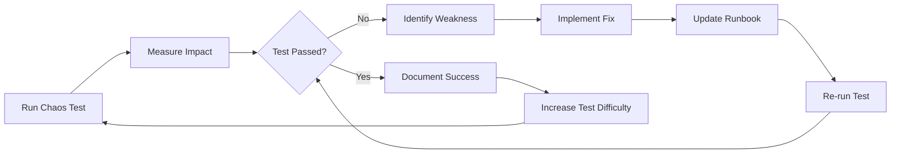

# Chaos Engineering Test Plan

**Rule: The system must fail safely and recover automatically.**

**Philosophy:** "Break things on purpose before they break by accident."

---

## Overview

This chaos engineering plan systematically tests LifeNavigator's resilience by deliberately introducing failures in a controlled manner. The goal is to identify weaknesses before they cause production incidents.

### Principles

1. **Build a Hypothesis**: Predict how the system will behave under failure
2. **Minimize Blast Radius**: Start with staging, limit impact in production
3. **Measure Everything**: Quantify impact on SLIs (latency, error rate, availability)
4. **Automate**: Chaos tests should run continuously, not just during drills
5. **Learn and Improve**: Every chaos test should result in actionable improvements

### Success Criteria

A chaos test **passes** if:
- ✅ System remains available (no complete outage)
- ✅ Error rate stays < 1%
- ✅ P95 latency increases < 2x baseline
- ✅ Data integrity maintained (no corruption/loss)
- ✅ Automatic recovery within RTO target
- ✅ Alerts fire correctly and on-call is paged

A chaos test **fails** if:
- ❌ Complete service outage
- ❌ Error rate > 5%
- ❌ Data loss or corruption
- ❌ Manual intervention required for recovery
- ❌ Silent failure (no alerts triggered)

---

## Chaos Testing Matrix

| Test | Target | Frequency | Environment | Impact | Owner |
|------|--------|-----------|-------------|---------|-------|
| **Pod Termination** | Backend pods | Weekly | Staging | LOW | SRE |
| **Node Failure** | Kubernetes nodes | Monthly | Staging | MEDIUM | SRE |
| **Database Latency** | Cloud SQL | Monthly | Staging | MEDIUM | SRE |
| **Network Partition** | Inter-service | Quarterly | Staging | HIGH | SRE |
| **Disk Pressure** | Persistent volumes | Quarterly | Staging | MEDIUM | SRE |
| **Memory Exhaustion** | Application pods | Quarterly | Staging | MEDIUM | Dev |
| **Dependency Failure** | GraphRAG, Redis | Bi-weekly | Staging | LOW | SRE |
| **API Overload** | Load spike 10x | Monthly | Staging | HIGH | SRE |
| **Configuration Rollback** | Invalid config | Quarterly | Staging | MEDIUM | SRE |
| **Cascading Failure** | Multi-component | Quarterly | Staging + Prod* | HIGH | SRE + EM |

*Production chaos tests require explicit approval and limited blast radius (< 5% traffic)

---

## Test Suite 1: Application Layer Chaos

### Test 1.1: Random Pod Termination

**Hypothesis:** System remains available when a single backend pod is terminated (Kubernetes automatically restarts it).

**Tools:**
- `kubectl delete pod` (manual)
- Chaos Mesh `PodChaos` (automated)
- Litmus Chaos (alternative)

**Implementation:**

```bash
# Manual execution (for learning)
#!/bin/bash
# Test: Random Pod Termination
# Expected: Zero downtime, pod restarts within 30 seconds

echo "=== Test 1.1: Random Pod Termination ==="

# 1. Baseline metrics
echo "Collecting baseline metrics..."
BASELINE_ERROR_RATE=$(curl -s "http://prometheus:9090/api/v1/query?query=rate(http_requests_total{status=~'5..'}[5m])" | jq -r '.data.result[0].value[1]')
echo "Baseline error rate: $BASELINE_ERROR_RATE"

# 2. Identify random pod
POD=$(kubectl get pods -n life-navigator -l app=backend -o jsonpath='{.items[0].metadata.name}')
echo "Targeting pod: $POD"

# 3. Terminate pod
echo "Terminating pod at $(date -u +%Y-%m-%dT%H:%M:%SZ)..."
kubectl delete pod $POD -n life-navigator --grace-period=0 --force

# 4. Monitor recovery
echo "Monitoring recovery..."
START_TIME=$(date +%s)

while true; do
    READY_PODS=$(kubectl get pods -n life-navigator -l app=backend -o json | jq '[.items[] | select(.status.phase=="Running" and .status.conditions[] | select(.type=="Ready" and .status=="True"))] | length')

    if [ "$READY_PODS" -ge 2 ]; then
        RECOVERY_TIME=$(($(date +%s) - START_TIME))
        echo "✓ Recovery successful in ${RECOVERY_TIME} seconds"
        break
    fi

    if [ $(($(date +%s) - START_TIME)) -gt 120 ]; then
        echo "✗ Recovery failed after 120 seconds"
        exit 1
    fi

    sleep 2
done

# 5. Verify error rate
sleep 10  # Wait for metrics to stabilize
ERROR_RATE=$(curl -s "http://prometheus:9090/api/v1/query?query=rate(http_requests_total{status=~'5..'}[5m])" | jq -r '.data.result[0].value[1]')
echo "Post-test error rate: $ERROR_RATE"

if (( $(echo "$ERROR_RATE < 0.01" | bc -l) )); then
    echo "✓ Error rate within acceptable range"
else
    echo "✗ Error rate exceeded threshold: $ERROR_RATE"
fi

# 6. Verify no data loss
echo "Verifying data integrity..."
kubectl exec -it deployment/backend -n life-navigator -- \
    python -c "from app.core.database import check_db_health; import asyncio; print('DB Health:', asyncio.run(check_db_health('main')))"

echo "=== Test 1.1 Complete ==="
```

**Automated with Chaos Mesh:**

```yaml
# k8s/chaos-tests/pod-kill-backend.yaml
apiVersion: chaos-mesh.org/v1alpha1
kind: PodChaos
metadata:
  name: backend-pod-kill
  namespace: life-navigator
spec:
  action: pod-kill
  mode: one
  selector:
    namespaces:
      - life-navigator
    labelSelectors:
      app: backend
  scheduler:
    cron: "@weekly"  # Run every week
  duration: "10s"
```

**Success Criteria:**
- ✅ Pod restarts within 30 seconds
- ✅ No increase in error rate (< 0.1%)
- ✅ API latency p95 < 500ms during recovery
- ✅ Prometheus alert "PodCrashLooping" does NOT fire

**Expected Failures to Fix:**
- ❌ Readiness probe not configured → Pods receive traffic before ready
- ❌ PodDisruptionBudget not set → Can terminate all pods simultaneously
- ❌ Graceful shutdown not implemented → In-flight requests fail

---

### Test 1.2: Backend Replica Scale-Down

**Hypothesis:** System handles sudden capacity reduction (replica count 4 → 1) without significant degradation.

**Implementation:**

```bash
#!/bin/bash
# Test: Sudden Capacity Reduction
# Expected: Autoscaler compensates within 2 minutes

echo "=== Test 1.2: Backend Replica Scale-Down ==="

# 1. Current replica count
CURRENT_REPLICAS=$(kubectl get deployment/backend -n life-navigator -o jsonpath='{.spec.replicas}')
echo "Current replicas: $CURRENT_REPLICAS"

# 2. Scale down to 1 replica
echo "Scaling down to 1 replica..."
kubectl scale deployment/backend -n life-navigator --replicas=1

# 3. Monitor HPA response
echo "Monitoring HPA autoscaling..."
START_TIME=$(date +%s)

while true; do
    CURRENT=$(kubectl get deployment/backend -n life-navigator -o jsonpath='{.spec.replicas}')
    CPU=$(kubectl top pods -n life-navigator -l app=backend --no-headers | awk '{sum+=$2} END {print sum}')

    echo "Replicas: $CURRENT, CPU: $CPU"

    if [ "$CURRENT" -ge "$CURRENT_REPLICAS" ]; then
        RECOVERY_TIME=$(($(date +%s) - START_TIME))
        echo "✓ HPA scaled back to $CURRENT replicas in ${RECOVERY_TIME} seconds"
        break
    fi

    if [ $(($(date +%s) - START_TIME)) -gt 300 ]; then
        echo "✗ HPA did not scale up within 5 minutes"
        # Manually restore replicas
        kubectl scale deployment/backend -n life-navigator --replicas=$CURRENT_REPLICAS
        exit 1
    fi

    sleep 10
done

echo "=== Test 1.2 Complete ==="
```

**Success Criteria:**
- ✅ HPA scales up within 2 minutes
- ✅ CPU utilization > 70% triggers scale-up
- ✅ Latency p95 < 1000ms during capacity reduction
- ✅ No failed requests (error rate = 0%)

---

### Test 1.3: Memory Leak Simulation

**Hypothesis:** System detects and restarts memory-exhausted pods before OOM kill.

**Implementation:**

```yaml
# k8s/chaos-tests/memory-stress-backend.yaml
apiVersion: chaos-mesh.org/v1alpha1
kind: StressChaos
metadata:
  name: backend-memory-stress
  namespace: life-navigator
spec:
  mode: one
  selector:
    namespaces:
      - life-navigator
    labelSelectors:
      app: backend
  stressors:
    memory:
      workers: 1
      size: "1GB"  # Allocate 1GB memory
      time: "5m"   # Sustain for 5 minutes
  duration: "5m"
```

**Success Criteria:**
- ✅ Kubernetes evicts pod when memory > 90% of limit
- ✅ New pod starts with normal memory usage
- ✅ Alert "PodMemoryPressure" fires correctly
- ✅ Monitoring shows memory leak detected

**Expected Findings:**
- Memory limits not configured → Pod not evicted, node OOM
- Memory leak in application code → Gradual degradation

---

## Test Suite 2: Data Layer Chaos

### Test 2.1: Database Connection Pool Exhaustion

**Hypothesis:** System gracefully handles database connection pool saturation by queuing requests.

**Implementation:**

```python
# backend/tests/chaos/test_db_pool_exhaustion.py
"""
Chaos Test: Database Connection Pool Exhaustion

Simulates connection pool saturation by spawning 100 concurrent queries.
"""

import asyncio
import pytest
from sqlalchemy import text
from app.core.database import get_main_session

@pytest.mark.chaos
@pytest.mark.asyncio
async def test_database_connection_pool_exhaustion():
    """
    Test database handles pool exhaustion gracefully.

    Expected behavior:
    - First 20 queries succeed (pool_size=20)
    - Next 10 queries succeed (max_overflow=10)
    - Remaining queries wait for available connection (timeout=30s)
    - No queries fail with "connection refused"
    """
    async def slow_query():
        """Simulate slow query that holds connection."""
        async with get_main_session() as session:
            # Hold connection for 5 seconds
            await session.execute(text("SELECT pg_sleep(5)"))
            result = await session.execute(text("SELECT 1"))
            return result.scalar()

    # Spawn 100 concurrent slow queries
    tasks = [slow_query() for _ in range(100)]

    start_time = asyncio.get_event_loop().time()
    results = await asyncio.gather(*tasks, return_exceptions=True)
    duration = asyncio.get_event_loop().time() - start_time

    # Verify results
    successful = sum(1 for r in results if r == 1)
    failed = sum(1 for r in results if isinstance(r, Exception))

    print(f"Successful queries: {successful}/100")
    print(f"Failed queries: {failed}/100")
    print(f"Total duration: {duration:.2f}s")

    # Assertions
    assert successful == 100, "Some queries failed due to pool exhaustion"
    assert duration < 60, "Queries took too long (timeout issue)"

    # Check if timeout errors occurred (connection wait exceeded 30s)
    timeout_errors = sum(1 for r in results if isinstance(r, asyncio.TimeoutError))
    assert timeout_errors == 0, f"{timeout_errors} queries timed out"
```

**Success Criteria:**
- ✅ All queries complete (no connection refused errors)
- ✅ Queries wait in queue up to pool_timeout (30s)
- ✅ Alert "DatabaseConnectionPoolExhausted" fires when utilization > 90%
- ✅ Pool recovers after slow queries complete

---

### Test 2.2: Database Replication Lag

**Hypothesis:** System tolerates database replication lag up to 5 seconds without user-visible errors.

**Implementation:**

```bash
#!/bin/bash
# Test: Database Replication Lag Tolerance
# Only applicable if read replicas are configured

echo "=== Test 2.2: Database Replication Lag ==="

# 1. Write data to primary
TIMESTAMP=$(date +%s)
kubectl exec -it deployment/backend -n life-navigator -- \
    python -c "
from app.core.database import get_main_session
import asyncio

async def write_test_record():
    async with get_main_session() as session:
        from sqlalchemy import text
        await session.execute(text(\"INSERT INTO test_replication (timestamp, data) VALUES ($TIMESTAMP, 'test')\"))
        await session.commit()

asyncio.run(write_test_record())
"

# 2. Immediately read from replica (should see replication lag)
for i in {1..10}; do
    echo "Read attempt $i..."
    # Read from replica (if configured)
    # This should return NULL initially (replication lag)
    # Then return data after lag resolves

    sleep 1
done

echo "=== Test 2.2 Complete ==="
```

**Success Criteria:**
- ✅ Application handles "read after write" inconsistency
- ✅ User sees eventual consistency (data appears within 5s)
- ✅ No errors shown to user during replication lag
- ✅ Critical reads go to primary (bypassing replicas)

---

### Test 2.3: Redis Complete Failure

**Hypothesis:** System remains functional (degraded performance) when Redis is completely unavailable.

**Implementation:**

```bash
#!/bin/bash
# Test: Redis Complete Failure
# Expected: Application continues with database fallback, fail-secure for token blacklist

echo "=== Test 2.3: Redis Complete Failure ==="

# 1. Baseline: Verify Redis is healthy
redis-cli -h $REDIS_HOST -p 6379 ping
echo "Redis is healthy"

# 2. Simulate Redis failure
kubectl scale deployment/redis -n life-navigator --replicas=0
echo "Redis scaled to 0 replicas"

# 3. Test application behavior
echo "Testing API without Redis..."

# Test 1: Login should work (no cache dependency)
curl -X POST https://api.lifenavigator.com/api/v1/auth/login \
    -H "Content-Type: application/json" \
    -d '{"email": "test@example.com", "password": "testpass"}'

# Test 2: Token blacklist should FAIL SECURE (deny all logout attempts)
# This is EXPECTED behavior - without Redis, we cannot verify blacklist
curl -X POST https://api.lifenavigator.com/api/v1/auth/logout \
    -H "Authorization: Bearer $TEST_TOKEN"

# Expected: Logout succeeds but warning logged "Redis unavailable, assuming token blacklisted"

# Test 3: Goals list should work (no cache, slower response)
TIME_START=$(date +%s%3N)
curl -H "Authorization: Bearer $TEST_TOKEN" \
    https://api.lifenavigator.com/api/v1/goals
TIME_END=$(date +%s%3N)
LATENCY=$((TIME_END - TIME_START))

echo "Goals latency without cache: ${LATENCY}ms"

if [ $LATENCY -lt 2000 ]; then
    echo "✓ Acceptable latency without cache"
else
    echo "✗ Latency too high: ${LATENCY}ms"
fi

# 4. Restore Redis
kubectl scale deployment/redis -n life-navigator --replicas=2
echo "Redis restored"

# Wait for Redis to be ready
kubectl wait --for=condition=ready pod -l app=redis -n life-navigator --timeout=60s

echo "=== Test 2.3 Complete ==="
```

**Success Criteria:**
- ✅ Application remains available (no 500 errors)
- ✅ Latency increases but stays < 2000ms
- ✅ Token blacklist FAILS SECURE (denies access without Redis)
- ✅ Cache rebuilds automatically when Redis restored
- ✅ Alert "RedisDown" fires correctly

---

## Test Suite 3: Network Chaos

### Test 3.1: Increased Network Latency

**Hypothesis:** System tolerates 500ms network latency to database without failures.

**Implementation:**

```yaml
# k8s/chaos-tests/network-delay-database.yaml
apiVersion: chaos-mesh.org/v1alpha1
kind: NetworkChaos
metadata:
  name: database-network-delay
  namespace: life-navigator
spec:
  action: delay
  mode: all
  selector:
    namespaces:
      - life-navigator
    labelSelectors:
      app: backend
  delay:
    latency: "500ms"
    correlation: "100"
    jitter: "50ms"
  direction: to
  target:
    mode: all
    selector:
      namespaces:
        - life-navigator
      labelSelectors:
        app: postgres  # Adjust for your Cloud SQL proxy pods
  duration: "5m"
```

**Success Criteria:**
- ✅ API latency p95 < 1500ms (500ms DB + 500ms processing + 500ms buffer)
- ✅ No timeout errors (connection_timeout=30s is sufficient)
- ✅ Connection pool does not exhaust (queries waiting for slow DB)

---

### Test 3.2: Network Packet Loss

**Hypothesis:** System handles 5% packet loss without request failures (TCP retransmits).

**Implementation:**

```yaml
# k8s/chaos-tests/network-packet-loss.yaml
apiVersion: chaos-mesh.org/v1alpha1
kind: NetworkChaos
metadata:
  name: network-packet-loss
  namespace: life-navigator
spec:
  action: loss
  mode: all
  selector:
    namespaces:
      - life-navigator
    labelSelectors:
      app: backend
  loss:
    loss: "5"      # 5% packet loss
    correlation: "25"
  duration: "10m"
```

**Success Criteria:**
- ✅ Error rate remains < 1% (TCP handles retransmits)
- ✅ Latency p99 increases but stays < 2000ms
- ✅ No "connection reset" errors

---

### Test 3.3: Network Partition (Split Brain)

**Hypothesis:** Database handles network partition gracefully (prevents split-brain via quorum).

**Implementation:**

```yaml
# k8s/chaos-tests/network-partition.yaml
apiVersion: chaos-mesh.org/v1alpha1
kind: NetworkChaos
metadata:
  name: network-partition
  namespace: life-navigator
spec:
  action: partition
  mode: all
  selector:
    namespaces:
      - life-navigator
    labelSelectors:
      app: backend
  direction: both
  target:
    mode: all
    selector:
      namespaces:
        - life-navigator
      labelSelectors:
        app: postgres
  duration: "2m"
```

**Success Criteria:**
- ✅ Database does not accept writes from minority partition
- ✅ Majority partition continues serving requests
- ✅ After partition heals, data is consistent (no divergence)
- ✅ Alert "DatabaseUnreachable" fires during partition

**CRITICAL:** This test can cause data unavailability. Only run in staging with approval.

---

## Test Suite 4: Dependency Chaos

### Test 4.1: GraphRAG Service Complete Failure

**Hypothesis:** Application degrades gracefully when GraphRAG is unavailable (AI features disabled, core app functional).

**Implementation:**

```bash
#!/bin/bash
# Test: GraphRAG Service Failure
# Expected: AI features return degraded responses, core app unaffected

echo "=== Test 4.1: GraphRAG Service Failure ==="

# 1. Simulate GraphRAG failure
kubectl scale deployment/graphrag-service -n life-navigator --replicas=0

# 2. Test GraphRAG-dependent endpoints
echo "Testing GraphRAG query (should return degraded response)..."
RESPONSE=$(curl -s -X POST https://api.lifenavigator.com/api/v1/graphrag/query \
    -H "Authorization: Bearer $TEST_TOKEN" \
    -H "Content-Type: application/json" \
    -d '{"query": "What are my career goals?", "max_results": 10}')

# Expected: 503 Service Unavailable OR degraded response from cache
STATUS=$(echo $RESPONSE | jq -r '.status')
if [ "$STATUS" = "503" ] || [ "$STATUS" = "degraded" ]; then
    echo "✓ GraphRAG correctly returned degraded response"
else
    echo "✗ Unexpected status: $STATUS"
fi

# 3. Test core app functionality (should be unaffected)
echo "Testing core goals endpoint (should work normally)..."
curl -H "Authorization: Bearer $TEST_TOKEN" \
    https://api.lifenavigator.com/api/v1/goals

# 4. Restore GraphRAG
kubectl scale deployment/graphrag-service -n life-navigator --replicas=2

echo "=== Test 4.1 Complete ==="
```

**Success Criteria:**
- ✅ GraphRAG queries return 503 or cached responses
- ✅ Core app (goals, health, finance) remains fully functional
- ✅ Error rate for non-GraphRAG endpoints = 0%
- ✅ User sees graceful degradation message: "AI features temporarily unavailable"

---

## Test Suite 5: Load and Capacity Chaos

### Test 5.1: API Traffic Spike (10x Normal Load)

**Hypothesis:** System handles 10x traffic spike via autoscaling without significant errors.

**Implementation:**

```bash
#!/bin/bash
# Test: 10x Traffic Spike
# Expected: HPA scales pods, error rate < 1%, latency < 2000ms

echo "=== Test 5.1: API Traffic Spike ==="

# 1. Baseline load
BASELINE_RPS=$(curl -s "http://prometheus:9090/api/v1/query?query=rate(http_requests_total[1m])" | jq -r '.data.result[0].value[1]')
echo "Baseline RPS: $BASELINE_RPS"

# 2. Generate 10x traffic using k6
k6 run --vus=1000 --duration=5m - <<EOF
import http from 'k6/http';
import { check } from 'k6';

export default function () {
    let res = http.get('https://api.lifenavigator.com/api/v1/health');
    check(res, {
        'status is 200': (r) => r.status === 200,
    });
}
EOF

# 3. Monitor autoscaling
kubectl get hpa -n life-navigator -w

# Expected: HPA should scale from 2 → 10+ pods within 2 minutes

# 4. Verify error rate
ERROR_RATE=$(curl -s "http://prometheus:9090/api/v1/query?query=rate(http_requests_total{status=~'5..'}[5m])" | jq -r '.data.result[0].value[1]')
echo "Error rate during spike: $ERROR_RATE"

if (( $(echo "$ERROR_RATE < 0.01" | bc -l) )); then
    echo "✓ Error rate acceptable: $ERROR_RATE"
else
    echo "✗ Error rate too high: $ERROR_RATE"
fi

echo "=== Test 5.1 Complete ==="
```

**Success Criteria:**
- ✅ HPA scales to meet demand (target: 70% CPU)
- ✅ Error rate < 1% during scaling
- ✅ Latency p95 < 2000ms during spike
- ✅ System stabilizes after traffic returns to normal

---

## Test Suite 6: Full Disaster Recovery Drills

### Test 6.1: Complete Region Failure

**Hypothesis:** Multi-region deployment allows traffic to failover to backup region within 5 minutes.

**Implementation:**

```bash
#!/bin/bash
# Test: Complete Region Failure (DR Drill)
# CRITICAL: This test requires multi-region setup and executive approval

echo "=== Test 6.1: Complete Region Failure (DR Drill) ==="

# 1. Pre-flight checks
echo "Pre-flight checks..."
kubectl get nodes  # Verify primary region is healthy
kubectl config use-context gke_lifenav-prod_us-east1_ln-dr-cluster  # Switch to DR cluster
kubectl get nodes  # Verify DR region is healthy

# 2. Simulate primary region failure
# Do NOT actually delete primary region in production!
# Instead, update DNS/load balancer to route to DR region

echo "Failing over to DR region..."
# Example: Update Cloud DNS or load balancer
gcloud dns record-sets transaction start --zone=lifenavigator-zone
gcloud dns record-sets transaction remove api.lifenavigator.com. \
    --name=api.lifenavigator.com. \
    --ttl=300 \
    --type=A \
    --zone=lifenavigator-zone \
    "35.123.45.67"  # Primary region IP

gcloud dns record-sets transaction add api.lifenavigator.com. \
    --name=api.lifenavigator.com. \
    --ttl=60 \
    --type=A \
    --zone=lifenavigator-zone \
    "34.98.76.54"  # DR region IP

gcloud dns record-sets transaction execute --zone=lifenavigator-zone

# 3. Wait for DNS propagation (TTL = 60s)
sleep 120

# 4. Verify traffic is flowing to DR region
curl https://api.lifenavigator.com/health | jq '.region'
# Expected: "us-east1" (DR region)

# 5. Test application functionality in DR region
# Run smoke tests...

# 6. Restore primary region (after drill)
# Reverse DNS changes...

echo "=== Test 6.1 Complete ==="
```

**Success Criteria:**
- ✅ DNS failover completes within 5 minutes
- ✅ Application remains available during failover
- ✅ Data is consistent across regions (replication lag < 1min)
- ✅ RTO target met: 15 minutes for complete recovery

---

## Chaos Engineering Tools

### Recommended Tools

| Tool | Use Case | Complexity | Cost |
|------|----------|------------|------|
| **Chaos Mesh** | Kubernetes-native chaos | Medium | Free (open-source) |
| **Litmus Chaos** | Kubernetes chaos with workflows | Medium | Free (open-source) |
| **Gremlin** | Enterprise chaos platform | Low | Paid ($$$) |
| **kubectl delete** | Manual pod/node deletion | Low | Free |
| **k6** | Load testing / traffic spikes | Low | Free (open-source) |
| **Toxiproxy** | Network chaos (latency, packet loss) | Medium | Free (open-source) |

**Recommended Setup:**
- **Staging:** Chaos Mesh + k6 (automated weekly tests)
- **Production:** Gremlin (limited blast radius, manual approval)

### Installing Chaos Mesh

```bash
# Install Chaos Mesh in staging cluster
kubectl create ns chaos-testing

helm repo add chaos-mesh https://charts.chaos-mesh.org
helm install chaos-mesh chaos-mesh/chaos-mesh \
  --namespace=chaos-testing \
  --set chaosDaemon.runtime=containerd \
  --set chaosDaemon.socketPath=/run/containerd/containerd.sock

# Verify installation
kubectl get pods -n chaos-testing

# Access Chaos Mesh dashboard
kubectl port-forward -n chaos-testing svc/chaos-dashboard 2333:2333
open http://localhost:2333
```

---

## Chaos Testing Schedule

### Weekly (Automated)
- ✅ Pod termination (random backend pod)
- ✅ Redis unavailability (5 minutes)
- ✅ GraphRAG service failure (10 minutes)

### Monthly (Automated + Review)
- ✅ Node failure (single node)
- ✅ Database latency injection (500ms for 10 minutes)
- ✅ API traffic spike (10x normal for 5 minutes)
- ✅ Review chaos test results with team

### Quarterly (Manual Drill)
- ✅ Network partition test
- ✅ Full database restore from backup
- ✅ Multi-region failover drill (with exec approval)
- ✅ Post-mortem and runbook updates

### Annually (Executive-Level Drill)
- ✅ Complete disaster recovery simulation
- ✅ Tabletop exercise with all stakeholders
- ✅ Regulatory compliance validation (HIPAA DR requirements)

---

## Measuring Chaos Testing Effectiveness

### Metrics to Track

```promql
# Mean Time Between Failures (MTBF) - should increase over time
# Track interval between SEV 1/2 incidents
days_since_last_critical_incident

# Mean Time to Recovery (MTTR) - should decrease over time
avg(incident_resolution_time_minutes{severity="SEV1"})

# Chaos Test Pass Rate - should approach 100%
(chaos_tests_passed / chaos_tests_total) * 100

# Automatic Recovery Rate - should increase over time
(incidents_auto_recovered / incidents_total) * 100
```

### Continuous Improvement Cycle



**Example Improvements from Chaos Testing:**

| Chaos Test | Finding | Fix Implemented | Result |
|------------|---------|-----------------|--------|
| Pod Termination | PodDisruptionBudget not set | Added PDB with minAvailable=1 | Zero downtime deployments |
| Redis Failure | App crashed on Redis unavailable | Implemented graceful degradation | App remains available |
| Database Latency | Connection pool exhausted | Increased pool size + timeouts | Handled slow queries |
| Traffic Spike | HPA too slow to scale | Tuned HPA (target: 50% CPU) | Faster autoscaling |

---

## Chaos Testing Best Practices

### DO:
- ✅ Start with staging environment
- ✅ Minimize blast radius (< 5% traffic in production)
- ✅ Run tests during business hours (team available to respond)
- ✅ Have rollback plan ready
- ✅ Notify team before production chaos tests
- ✅ Monitor continuously during test
- ✅ Document findings and improvements

### DON'T:
- ❌ Run chaos tests in production without approval
- ❌ Test during peak traffic hours (initially)
- ❌ Test multiple failures simultaneously (until confident)
- ❌ Ignore failed tests ("it's just chaos testing")
- ❌ Skip post-test analysis
- ❌ Forget to update runbooks with learnings

---

## Chaos Testing Checklist

**Before Test:**
- [ ] Runbook for failure scenario reviewed
- [ ] Blast radius defined (< 5% users for prod)
- [ ] Rollback plan documented
- [ ] On-call engineer notified
- [ ] Monitoring dashboards open
- [ ] Incident channel created (#chaos-test-YYYYMMDD)

**During Test:**
- [ ] Metrics collected (error rate, latency, availability)
- [ ] User impact monitored (support tickets, Twitter)
- [ ] Automatic recovery observed (or manual intervention documented)
- [ ] Alerts verified (did correct alerts fire?)

**After Test:**
- [ ] Test results documented
- [ ] Weaknesses identified
- [ ] Action items created (Jira tickets)
- [ ] Runbooks updated
- [ ] Team debrief scheduled
- [ ] Next test scheduled

---

**Last Updated:** 2026-01-09
**Next Review:** 2026-02-09
**Owner:** SRE Lead
**Status:** Active - Weekly automated tests running
