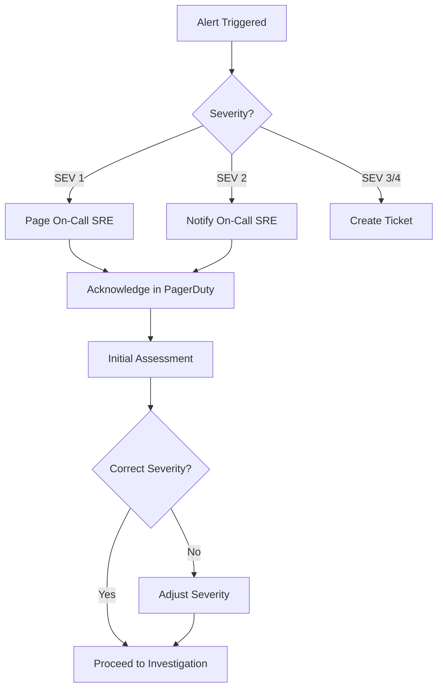
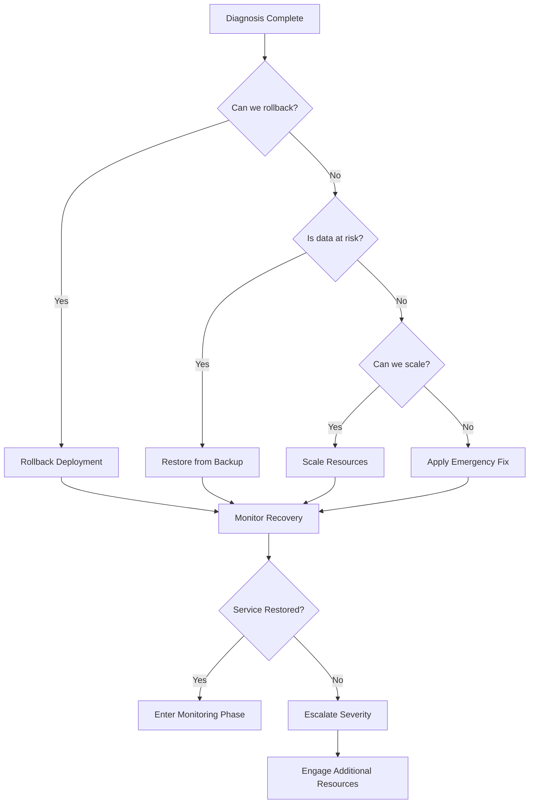

# Incident Severity Classification and Response

**Rule: Every incident must have a playbook.**

---

## Incident Severity Levels

### SEV 1 - CRITICAL (Response Time: Immediate)

**Definition:** Complete service outage or data breach affecting all users or exposing PHI/PII.

**Business Impact:**
- All users unable to access application
- PHI/PII data breach or unauthorized access
- HIPAA violation with potential regulatory consequences
- Revenue impact > $10K/hour

**Examples:**
- API backend completely down (all pods crashlooping)
- HIPAA database unavailable or corrupted
- Authentication system failure (no user can login)
- Security breach detected (unauthorized PHI access)
- Data loss exceeding RPO targets

**Response Protocol:**

| Action | Owner | Deadline |
|--------|-------|----------|
| **Detect & Alert** | Prometheus/PagerDuty | < 2 minutes |
| **Acknowledge** | On-call SRE | < 5 minutes |
| **Declare Incident** | On-call SRE | Immediately after acknowledgment |
| **Assemble War Room** | Incident Commander | < 10 minutes |
| **Notify Stakeholders** | Incident Commander | < 15 minutes |
| **Initial Assessment** | Technical Lead | < 15 minutes |
| **Mitigation Started** | SRE Team | < 30 minutes |
| **Status Updates** | Communications Lead | Every 30 minutes |

**Escalation:**
- CEO (if downtime > 1 hour)
- Legal (if PHI/PII exposure suspected)
- Compliance Officer (if HIPAA violation suspected)
- GCP Support (Premium, open P1 ticket)

**Runbooks:**
- [Restore HIPAA Database](./runbooks/RESTORE_HIPAA_DATABASE.md)
- [API Backend Complete Failure](./runbooks/RESTORE_API_BACKEND.md)
- [Authentication System Failure](./runbooks/RESTORE_AUTHENTICATION.md)
- [Security Breach Response](./runbooks/SECURITY_BREACH_RESPONSE.md)

---

### SEV 2 - HIGH (Response Time: 15 minutes)

**Definition:** Partial service degradation affecting significant portion of users or critical features unavailable.

**Business Impact:**
- 25%+ of users affected
- Critical features unavailable (health records, financial data, goals)
- Performance degradation > 5x normal latency
- Revenue impact $1K-$10K/hour

**Examples:**
- Database performance degradation (connection pool exhausted)
- GraphRAG service completely down (AI features unavailable)
- Single availability zone failure (partial capacity loss)
- API error rate > 10%
- Read replica failure (performance impact)

**Response Protocol:**

| Action | Owner | Deadline |
|--------|-------|----------|
| **Detect & Alert** | Prometheus | < 5 minutes |
| **Acknowledge** | On-call SRE | < 15 minutes |
| **Initial Investigation** | On-call SRE | < 30 minutes |
| **Notify Team** | On-call SRE | < 30 minutes |
| **Mitigation Started** | SRE Team | < 1 hour |
| **Status Updates** | On-call SRE | Every 1 hour |

**Escalation:**
- Engineering Manager (if unresolved after 2 hours)
- VP Engineering (if unresolved after 4 hours)

**Runbooks:**
- [Database Pool Saturation](../runbooks/db-pool-saturation.md)
- [High API Error Rate](../runbooks/high-error-rate.md)
- [GraphRAG Service Degradation](./runbooks/GRAPHRAG_RECOVERY.md)
- [Redis Cluster Failure](./runbooks/REDIS_RECOVERY.md)

---

### SEV 3 - MEDIUM (Response Time: 1 hour)

**Definition:** Minor service degradation affecting small subset of users or non-critical features.

**Business Impact:**
- < 25% of users affected
- Non-critical features unavailable (notifications, analytics)
- Performance degradation 2-5x normal latency
- Revenue impact < $1K/hour

**Examples:**
- Background job failures (email notifications, data sync)
- Monitoring/logging system degradation
- Cache miss rate elevated (performance impact but functional)
- Single pod crashlooping (redundancy maintains service)
- Plaid sync failures (financial data delayed)

**Response Protocol:**

| Action | Owner | Deadline |
|--------|-------|----------|
| **Detect & Alert** | Monitoring | < 15 minutes |
| **Acknowledge** | On-call SRE | < 1 hour |
| **Investigation** | On-call SRE | < 2 hours |
| **Mitigation Plan** | On-call SRE | < 4 hours |
| **Status Updates** | On-call SRE | Daily until resolved |

**Escalation:**
- Engineering Manager (if unresolved after 24 hours)

**Runbooks:**
- [Background Job Failures](./runbooks/BACKGROUND_JOB_RECOVERY.md)
- [Cache Degradation](./runbooks/CACHE_RECOVERY.md)
- [Monitoring System Issues](./runbooks/MONITORING_RECOVERY.md)

---

### SEV 4 - LOW (Response Time: Next business day)

**Definition:** Minor issues with no user impact or cosmetic/UX issues.

**Business Impact:**
- No user-facing impact
- Internal tooling degraded
- Cosmetic UI issues
- Documentation gaps

**Examples:**
- Development environment issues
- Non-critical logging gaps
- UI text typos
- Internal dashboard missing data
- Staging environment failures

**Response Protocol:**

| Action | Owner | Deadline |
|--------|-------|----------|
| **Detection** | Manual or monitoring | Varies |
| **Triage** | Assigned Engineer | Next business day |
| **Fix** | Assigned Engineer | Sprint planning |

**No escalation required.**

**Tracking:** Jira ticket, standard development workflow

---

## Incident Response Workflow

### Phase 1: Detection and Triage (< 5 minutes)



**Actions:**
1. **Alert received** via Prometheus → Alertmanager → PagerDuty
2. **On-call acknowledges** within SLA (5 min SEV1, 15 min SEV2)
3. **Initial triage:** Confirm severity level
4. **Declare incident:** Open incident channel (#incident-YYYY-MM-DD-HHMM)
5. **Notify stakeholders** per severity level

### Phase 2: Investigation and Diagnosis (< 15 minutes)

**Key Questions:**
- ✅ What is broken? (Specific subsystem/component)
- ✅ How many users affected? (% of user base)
- ✅ When did it start? (Timeline)
- ✅ What changed recently? (Deployments, config, traffic)
- ✅ Is data at risk? (PHI, PII, financial data)

**Investigation Checklist:**

```bash
# 1. Check system health
kubectl get pods -n life-navigator
kubectl top nodes

# 2. Review recent changes
kubectl rollout history deployment/backend -n life-navigator
git log --oneline --since="2 hours ago"

# 3. Check error rates
open https://grafana.lifenavigator.com/d/api-health

# 4. Review logs
kubectl logs -n life-navigator -l app=backend --tail=100 | grep ERROR

# 5. Check database health
gcloud sql instances describe ln-health-db-beta --project=lifenav-prod
```

**Document findings in incident tracker:**
- Root cause hypothesis
- Affected subsystems
- Estimated user impact
- Potential data loss risk

### Phase 3: Mitigation (Variable, see RTO targets)

**Decision Tree:**



**Mitigation Options (by priority):**

1. **Rollback** (fastest, lowest risk)
   ```bash
   kubectl rollout undo deployment/backend -n life-navigator
   ```

2. **Scale Resources** (for capacity issues)
   ```bash
   kubectl scale deployment/backend -n life-navigator --replicas=10
   ```

3. **Traffic Redirect** (for partial failures)
   ```bash
   # Route traffic to backup region
   kubectl apply -f k8s/overlays/dr-failover
   ```

4. **Restore from Backup** (for data corruption)
   - Follow subsystem-specific restore runbook
   - HIPAA DB: [RESTORE_HIPAA_DATABASE.md](./runbooks/RESTORE_HIPAA_DATABASE.md)
   - Main DB: [RESTORE_MAIN_DATABASE.md](./runbooks/RESTORE_MAIN_DATABASE.md)

5. **Emergency Patch** (last resort)
   - Requires approval from Engineering Manager (SEV 1/2)
   - Must include rollback plan

### Phase 4: Monitoring and Verification (15-60 minutes)

**Post-Mitigation Checks:**

```bash
# 1. Verify service health
curl https://api.lifenavigator.com/health
curl https://api.lifenavigator.com/health/ready

# 2. Check error rate normalized
# Target: < 0.1% error rate
open https://grafana.lifenavigator.com/d/api-health

# 3. Verify database connectivity
kubectl exec -it deploy/backend -n life-navigator -- \
  python -c "from app.core.database import check_db_health; import asyncio; asyncio.run(check_db_health('main'))"

# 4. Test critical user flows
# - Login
# - View health records
# - Create goal
# - GraphRAG query

# 5. Monitor for 15-60 minutes (depends on severity)
# Watch for error spikes, latency increases, or recurrence
```

**Criteria for Resolution:**
- ✅ Error rate < 0.1% for 15 minutes (SEV 1/2) or 5 minutes (SEV 3/4)
- ✅ API latency p95 < 500ms
- ✅ No active alerts for affected subsystem
- ✅ User-reported issues resolved (check support channels)
- ✅ Data integrity verified (if applicable)

### Phase 5: Resolution and Communication

**Incident Closure Checklist:**

```bash
# Calculate incident metrics
INCIDENT_DURATION=$(($(date +%s) - $INCIDENT_START_TIME))
echo "Total incident duration: $((INCIDENT_DURATION / 60)) minutes"

# Document in incident tracker:
# - Timeline (detection → mitigation → resolution)
# - Root cause
# - User impact (affected users, data loss)
# - RTO/RPO actual vs target
# - Actions taken
# - Lessons learned
```

**User Communication (if customer-facing):**

| Severity | Communication | Channel | Timing |
|----------|---------------|---------|--------|
| SEV 1 | Status page update + email | Public | Every 30 min during incident |
| SEV 2 | Status page update | Public | Hourly during incident |
| SEV 3 | Post-mortem email (optional) | Affected users | After resolution |
| SEV 4 | None required | N/A | N/A |

**Example Status Update (SEV 1):**

```
🔴 INVESTIGATING: We are investigating reports of users unable to access health records.
Our team is actively working on a resolution. Next update in 30 minutes.
Time: 2025-12-14 10:35 UTC

🔄 IDENTIFIED: We have identified the issue with our health database and are restoring
from backup. Service should be restored within 15 minutes.
Time: 2025-12-14 10:50 UTC

✅ RESOLVED: Health record access has been fully restored. All systems are operating normally.
We apologize for the disruption.
Time: 2025-12-14 11:05 UTC
```

### Phase 6: Post-Mortem (Within 48 hours for SEV 1/2)

**Required Attendees:**
- Incident Commander
- On-call SRE(s)
- Engineering Manager
- Product Manager (if user-facing)
- Compliance Officer (if PHI/PII involved)

**Post-Mortem Template:**

```markdown
# Incident Post-Mortem: [INCIDENT-ID]

## Summary
- **Date:** YYYY-MM-DD
- **Severity:** SEV X
- **Duration:** X minutes
- **User Impact:** X users affected
- **Data Loss:** [None | X records lost, RPO: X minutes]

## Timeline
| Time (UTC) | Event |
|------------|-------|
| 10:30 | Alert triggered: HIPAA database connection failures |
| 10:32 | On-call SRE acknowledged |
| 10:35 | Incident declared (SEV 1) |
| 10:40 | War room assembled |
| 10:45 | Root cause identified: data corruption |
| 10:50 | PITR restoration initiated |
| 11:00 | Database restored, backend restarted |
| 11:05 | Service verified healthy |
| 11:20 | Incident resolved |

## Root Cause
[Detailed technical explanation of what caused the incident]

## Contributing Factors
1. [Factor 1, e.g., "Lack of automated corruption detection"]
2. [Factor 2, e.g., "Manual deployment process allowed bad migration"]
3. [Factor 3, e.g., "Insufficient backup verification testing"]

## What Went Well
1. [Positive aspect 1, e.g., "PITR completed within RTO target"]
2. [Positive aspect 2, e.g., "Cross-functional team responded quickly"]
3. [Positive aspect 3, e.g., "Communication with users was clear and timely"]

## What Went Wrong
1. [Issue 1, e.g., "Detection took 5 minutes vs target of 2 minutes"]
2. [Issue 2, e.g., "Runbook had outdated commands"]
3. [Issue 3, e.g., "No recent DR drill to validate procedure"]

## Action Items
| Item | Owner | Due Date | Priority |
|------|-------|----------|----------|
| Implement automated backup validation | @sre-lead | 2025-12-21 | P0 |
| Update PITR runbook with correct gcloud commands | @on-call-sre | 2025-12-15 | P0 |
| Schedule quarterly DR drill | @eng-manager | 2025-01-15 | P1 |
| Add pre-migration validation checks | @backend-lead | 2025-12-28 | P1 |
| Improve alert sensitivity for database errors | @sre-lead | 2025-12-20 | P2 |

## Compliance Notes (if PHI/PII involved)
- **Data Loss:** [Quantify]
- **Breach Notification Required:** [Yes/No]
- **Affected Records:** [Count]
- **Compliance Officer Notified:** [Yes/No]
```

---

## Runbook Index

### Critical (SEV 1)
- ✅ [Restore HIPAA Database](./runbooks/RESTORE_HIPAA_DATABASE.md) - RTO: 15min, RPO: 1min
- ✅ [Restore Main Database](./runbooks/RESTORE_MAIN_DATABASE.md) - RTO: 30min, RPO: 5min
- ✅ [Restore Financial Database](./runbooks/RESTORE_FINANCIAL_DATABASE.md) - RTO: 30min, RPO: 5min
- ✅ [API Backend Complete Failure](./runbooks/RESTORE_API_BACKEND.md) - RTO: 15min
- ✅ [Authentication System Failure](./runbooks/RESTORE_AUTHENTICATION.md) - RTO: 10min
- ✅ [Security Breach Response](./runbooks/SECURITY_BREACH_RESPONSE.md) - Immediate

### High (SEV 2)
- ✅ [Database Pool Saturation](../runbooks/db-pool-saturation.md)
- ✅ [High API Error Rate](../runbooks/high-error-rate.md)
- ✅ [GraphRAG Service Unreachable](../runbooks/graphrag-unreachable.md)
- ✅ [Redis Cluster Failure](./runbooks/REDIS_RECOVERY.md)
- ✅ [Neo4j Knowledge Graph Failure](./runbooks/NEO4J_RECOVERY.md)

### Medium (SEV 3)
- ✅ [Background Job Failures](./runbooks/BACKGROUND_JOB_RECOVERY.md)
- ✅ [Cache Degradation](./runbooks/CACHE_RECOVERY.md)
- ✅ [Monitoring System Issues](./runbooks/MONITORING_RECOVERY.md)
- ✅ [Email Notification Failures](./runbooks/EMAIL_NOTIFICATION_RECOVERY.md)

---

## Incident Metrics and SLAs

### Response Time SLAs

| Severity | Detection | Acknowledgment | Initial Response | Mitigation Start | Resolution Target |
|----------|-----------|----------------|------------------|------------------|-------------------|
| **SEV 1** | < 2 min | < 5 min | < 10 min | < 30 min | < RTO (15-30 min) |
| **SEV 2** | < 5 min | < 15 min | < 30 min | < 1 hour | < 4 hours |
| **SEV 3** | < 15 min | < 1 hour | < 2 hours | < 4 hours | < 24 hours |
| **SEV 4** | Varies | Next business day | Next business day | Next sprint | Next sprint |

### Monthly Incident Review Metrics

Track and review monthly:

```sql
-- Example queries for incident database
SELECT
    severity,
    COUNT(*) as incident_count,
    AVG(resolution_time_minutes) as avg_resolution_time,
    SUM(affected_users) as total_affected_users
FROM incidents
WHERE created_at >= DATE_TRUNC('month', CURRENT_DATE)
GROUP BY severity
ORDER BY severity;
```

**Target Metrics:**
- **Mean Time to Detect (MTTD):** < 5 minutes for SEV 1/2
- **Mean Time to Acknowledge (MTTA):** < SLA for each severity
- **Mean Time to Resolve (MTTR):** < RTO for each subsystem
- **Incident Recurrence Rate:** < 10% (same root cause within 30 days)

### Incident Cost Calculation

```python
# Calculate incident cost for reporting
def calculate_incident_cost(severity, duration_minutes, affected_users):
    """
    Calculate estimated cost of incident.

    Based on:
    - Revenue loss (users unable to transact)
    - Engineering time (hourly rate × responders × duration)
    - Potential regulatory fines (HIPAA violations)
    """
    # Revenue impact
    arpu = 25000 / 365 / 24 / 60  # Annual Revenue Per User → per minute
    revenue_loss = affected_users * arpu * duration_minutes

    # Engineering cost
    avg_hourly_rate = 150  # Blended rate for SRE/Engineering
    responder_count = {"SEV1": 5, "SEV2": 3, "SEV3": 1, "SEV4": 1}[severity]
    eng_cost = avg_hourly_rate * responder_count * (duration_minutes / 60)

    # Regulatory risk (if PHI involved)
    regulatory_risk = 0
    if "PHI" in incident_tags:
        regulatory_risk = 50000  # Base HIPAA violation fine

    total_cost = revenue_loss + eng_cost + regulatory_risk
    return {
        "revenue_loss": revenue_loss,
        "engineering_cost": eng_cost,
        "regulatory_risk": regulatory_risk,
        "total_cost": total_cost,
    }
```

---

**Last Updated:** 2026-01-09
**Next Review:** 2026-02-09 (Monthly)
**Owner:** SRE Lead
