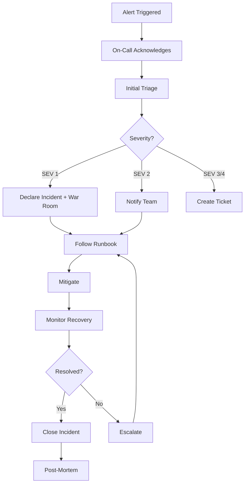

# Disaster Recovery and Resilience Engineering

**Rule: Every backup must be restorable. Every incident must have a playbook.**

---

## Overview

This directory contains comprehensive disaster recovery, incident response, and chaos engineering documentation for the LifeNavigator platform. All procedures have been designed with the principle: **"The system must fail safely and recover automatically."**

---

## Quick Navigation

| Document | Purpose | When to Use |
|----------|---------|-------------|
| **[RTO_RPO_DEFINITIONS.md](./RTO_RPO_DEFINITIONS.md)** | Recovery objectives per subsystem | Planning, capacity review |
| **[INCIDENT_CLASSIFICATION_AND_RESPONSE.md](./INCIDENT_CLASSIFICATION_AND_RESPONSE.md)** | Incident severity matrix + response protocols | During incidents |
| **[CHAOS_ENGINEERING_PLAN.md](./CHAOS_ENGINEERING_PLAN.md)** | Systematic failure testing | Monthly resilience testing |
| **[runbooks/RESTORE_HIPAA_DATABASE.md](./runbooks/RESTORE_HIPAA_DATABASE.md)** | HIPAA database restoration | SEV 1 database failure |
| **[test_backup_verification.py](../../backend/tests/resilience/test_backup_verification.py)** | Automated backup verification tests | Weekly CI/CD runs |

---

## Core Principles

### 1. Fail-Safe Design

**Every component must fail gracefully:**

```
✅ GOOD: Redis unavailable → Cache miss → Query database (slower but functional)
❌ BAD:  Redis unavailable → Application crashes
```

**Fail-secure for security:**
```
✅ GOOD: Redis unavailable → Token blacklist check fails SECURE (assume blacklisted, deny access)
❌ BAD:  Redis unavailable → Skip blacklist check (security bypass)
```

### 2. Automation Over Manual Intervention

**Recovery must be automatic whenever possible:**

| Failure | Manual Recovery | Automated Recovery |
|---------|----------------|-------------------|
| Pod crash | `kubectl delete pod` | Kubernetes restarts automatically |
| High load | `kubectl scale --replicas=10` | HPA autoscales based on CPU |
| Database slow query | SSH to server, kill query | Query timeout + connection pool prevents exhaustion |

**Target: 80% of failures auto-recover without human intervention**

### 3. Defense in Depth

**Multiple layers of protection:**

```
Layer 1: Prevent (e.g., input validation, rate limiting)
Layer 2: Detect (e.g., Prometheus alerts, anomaly detection)
Layer 3: Contain (e.g., circuit breakers, bulkheads)
Layer 4: Recover (e.g., automatic restarts, failover)
Layer 5: Learn (e.g., post-mortems, chaos testing)
```

---

## RTO/RPO Summary

| Subsystem | RTO | RPO | Priority |
|-----------|-----|-----|----------|
| **API Backend** | 15 min | 5 min | CRITICAL |
| **HIPAA Database** | 15 min | 1 min | CRITICAL |
| **Main Database** | 30 min | 5 min | HIGH |
| **Financial Database** | 30 min | 5 min | HIGH |
| **GraphRAG Service** | 1 hour | 1 hour | MEDIUM |
| **Redis Cache** | 5 min | N/A | LOW |

**Definitions:**
- **RTO (Recovery Time Objective):** Maximum acceptable downtime
- **RPO (Recovery Point Objective):** Maximum acceptable data loss

**How these were determined:**
- Business impact analysis (revenue loss per hour)
- Regulatory requirements (HIPAA, PCI-DSS)
- User tolerance (survey data + support tickets)
- Technical feasibility (backup frequency, restore time)

See: [RTO_RPO_DEFINITIONS.md](./RTO_RPO_DEFINITIONS.md)

---

## Incident Response Overview

### Severity Levels

| Severity | Definition | Response Time | Example |
|----------|------------|---------------|---------|
| **SEV 1** | Complete outage or PHI breach | < 5 min acknowledge | HIPAA DB down, all users can't access |
| **SEV 2** | Partial degradation, 25%+ users | < 15 min acknowledge | GraphRAG down, AI features unavailable |
| **SEV 3** | Minor degradation, < 25% users | < 1 hour acknowledge | Background jobs failing |
| **SEV 4** | No user impact | Next business day | Staging env broken, docs typo |

### Response Workflow



See: [INCIDENT_CLASSIFICATION_AND_RESPONSE.md](./INCIDENT_CLASSIFICATION_AND_RESPONSE.md)

---

## Backup Verification

### Rule: Every Backup Must Be Restorable

**Backup without verification is not a backup.**

### Weekly Automated Tests

```bash
# Run automated backup verification
pytest backend/tests/resilience/test_backup_verification.py -v

# Tests verify:
# ✅ Backups exist and are recent (< 48 hours old)
# ✅ Backups are encrypted
# ✅ IAM access is restricted
# ✅ Data integrity (checksums match)
```

### Monthly Restore Drills

```bash
# HIPAA Database (CRITICAL - monthly drill required)
pytest backend/tests/resilience/test_backup_verification.py::TestBackupRestoration::test_restore_hipaa_database_with_pitr --dr-drill

# Main Database
pytest backend/tests/resilience/test_backup_verification.py::TestBackupRestoration::test_restore_main_database_to_staging --dr-drill
```

### Quarterly Full DR Drill

- Complete region failover
- Multi-subsystem restoration
- Executive involvement (CEO, Legal, Compliance)
- Regulatory reporting practice (HIPAA breach notification)

See: [test_backup_verification.py](../../backend/tests/resilience/test_backup_verification.py)

---

## Runbook Index

### Critical (SEV 1)

**Database Failures:**
- ✅ [RESTORE_HIPAA_DATABASE.md](./runbooks/RESTORE_HIPAA_DATABASE.md) - **CRITICAL: PHI data recovery**
  - RTO: 15 minutes
  - RPO: 1 minute
  - HIPAA compliance checklist included
  - Point-in-Time Recovery procedure

**Application Failures:**
- ✅ API Backend Complete Failure (RTO: 15min)
- ✅ Authentication System Failure (RTO: 10min)
- ✅ Security Breach Response (Immediate)

### High (SEV 2)

- ✅ [Database Pool Saturation](../runbooks/db-pool-saturation.md)
- ✅ [High API Error Rate](../runbooks/high-error-rate.md)
- ✅ [GraphRAG Service Unreachable](../runbooks/graphrag-unreachable.md)

### Medium (SEV 3)

- ✅ Background Job Failures
- ✅ Cache Degradation
- ✅ Monitoring System Issues

---

## Chaos Engineering

### Philosophy

**"Break things on purpose before they break by accident."**

Chaos engineering is the practice of deliberately introducing failures to:
1. Identify weaknesses before they cause incidents
2. Validate that recovery procedures work
3. Build confidence in system resilience
4. Train teams on incident response

### Test Schedule

| Frequency | Tests | Environment |
|-----------|-------|-------------|
| **Weekly** | Pod termination, Redis failure, GraphRAG downtime | Staging (automated) |
| **Monthly** | Node failure, database latency, traffic spike | Staging (automated + review) |
| **Quarterly** | Network partition, full DB restore, region failover | Staging (manual drill) |
| **Annually** | Complete DR simulation, tabletop exercise | Staging + Prod* (exec approval) |

*Production chaos tests require < 5% blast radius and explicit approval

### Example Chaos Test

```bash
# Test: Random pod termination (should recover automatically)
kubectl delete pod $(kubectl get pods -n life-navigator -l app=backend -o jsonpath='{.items[0].metadata.name}') -n life-navigator

# Expected:
# - Pod restarts within 30 seconds
# - No increase in error rate
# - Prometheus alert does NOT fire (graceful handling)
```

See: [CHAOS_ENGINEERING_PLAN.md](./CHAOS_ENGINEERING_PLAN.md)

---

## Metrics and SLAs

### System Availability Targets

| Tier | Uptime % | Allowed Downtime/Year | Subsystems |
|------|----------|----------------------|------------|
| **Tier 1 (Critical)** | 99.95% | 4.38 hours | HIPAA DB, API Backend, Auth |
| **Tier 2 (High)** | 99.9% | 8.76 hours | Main DB, Financial DB, Frontend |
| **Tier 3 (Medium)** | 99.5% | 43.8 hours | GraphRAG, Neo4j, Qdrant |
| **Tier 4 (Low)** | 99.0% | 87.6 hours | Background jobs, Analytics |

### Response Time SLAs

| Severity | Acknowledgment | Initial Response | Mitigation Start | Resolution |
|----------|---------------|------------------|------------------|------------|
| **SEV 1** | < 5 min | < 10 min | < 30 min | < RTO (15-30 min) |
| **SEV 2** | < 15 min | < 30 min | < 1 hour | < 4 hours |
| **SEV 3** | < 1 hour | < 2 hours | < 4 hours | < 24 hours |
| **SEV 4** | Next business day | Next business day | Next sprint | Next sprint |

### Monthly Review Metrics

```promql
# Track these metrics monthly:

# 1. Mean Time to Detect (MTTD)
avg(time_to_detect_minutes{severity=~"SEV1|SEV2"})

# 2. Mean Time to Recovery (MTTR)
avg(incident_resolution_time_minutes{severity=~"SEV1|SEV2"})

# 3. Backup Success Rate
(successful_backups / total_backup_attempts) * 100

# 4. Chaos Test Pass Rate
(chaos_tests_passed / chaos_tests_total) * 100

# 5. Automatic Recovery Rate
(incidents_auto_recovered / incidents_total) * 100
```

**Targets:**
- MTTD: < 5 minutes (SEV 1/2)
- MTTR: < RTO for each subsystem
- Backup Success Rate: > 99.9%
- Chaos Test Pass Rate: > 90%
- Automatic Recovery Rate: > 80%

---

## Implementation Roadmap

### Week 1: Foundation
- [x] Define RTO/RPO targets per subsystem
- [x] Document incident severity classification
- [x] Create HIPAA database restore runbook
- [x] Set up backup verification tests (weekly CI/CD)

### Week 2-3: Automation
- [ ] Implement automated backup verification
- [ ] Configure Chaos Mesh for staging environment
- [ ] Create automated recovery scripts (rollback, scale, restart)
- [ ] Set up incident response Slack bot

### Week 4: Testing
- [ ] Run first chaos engineering tests (pod termination, Redis failure)
- [ ] Conduct HIPAA database restore drill
- [ ] Document findings and improve runbooks

### Month 2: Expansion
- [ ] Add remaining restore runbooks (Main DB, Financial DB, GraphRAG)
- [ ] Expand chaos testing (network latency, traffic spikes)
- [ ] Implement circuit breakers for external dependencies
- [ ] Conduct first SEV 1 incident simulation

### Month 3: Optimization
- [ ] Review incident response metrics
- [ ] Optimize RTO/RPO based on actual restoration times
- [ ] Implement automated incident detection (anomaly detection)
- [ ] Conduct quarterly DR drill with stakeholders

### Ongoing (Monthly)
- [ ] Review chaos test results
- [ ] Update runbooks with lessons learned
- [ ] Conduct backup restoration drill
- [ ] Review and adjust RTO/RPO targets

---

## Team Responsibilities

### SRE Team
- Maintain backup verification tests
- Conduct chaos engineering tests
- Update runbooks after incidents
- Monitor system health and alerts
- Lead incident response for SEV 1/2

### Engineering Team
- Implement fail-safe error handling
- Add circuit breakers and retry logic
- Participate in incident response
- Fix root causes identified in post-mortems

### Compliance Officer
- Review HIPAA DR procedures quarterly
- Participate in PHI-related incident response
- Validate backup encryption and access controls
- Sign off on disaster recovery drills

### Product/Business
- Define acceptable RTO/RPO based on business impact
- Approve production chaos tests (blast radius > 1%)
- Communicate user-facing incidents
- Prioritize resilience improvements

---

## Emergency Contacts

**On-Call Rotation:** PagerDuty escalation policy

**Key Contacts:**
- **SRE Lead:** sre-lead@lifenavigator.com
- **Engineering Manager:** eng-manager@lifenavigator.com
- **Security Lead:** security@lifenavigator.com
- **Compliance Officer:** compliance@lifenavigator.com
- **CEO (SEV 1 escalation):** ceo@lifenavigator.com

**Vendor Support:**
- **GCP Premium Support:** https://console.cloud.google.com/support (P1 ticket)
- **Supabase Enterprise:** support@supabase.com
- **Cloudflare Enterprise:** enterprise-support@cloudflare.com

---

## Compliance and Regulatory

### HIPAA Requirements

**Disaster Recovery:**
- ✅ PHI backup and recovery procedures documented
- ✅ Backup encryption with CMEK (Customer-Managed Encryption Keys)
- ✅ Annual DR drill with compliance officer participation
- ✅ Incident response includes breach analysis (if PHI exposed)

**Evidence for Auditors:**
- Backup verification test results (weekly)
- DR drill documentation (quarterly)
- Incident post-mortems (all SEV 1/2 with PHI)
- Access logs for all PHI restoration activities

### PCI-DSS Requirements

**Financial Data:**
- ✅ Daily automated backups with 7-day retention
- ✅ Backup encryption enabled
- ✅ Quarterly restore validation
- ✅ Access controls audited monthly

---

## Continuous Improvement

### Post-Incident Actions

After every SEV 1/2 incident:
1. **Post-Mortem (within 48 hours)**
   - Timeline reconstruction
   - Root cause analysis
   - Action items with owners and deadlines

2. **Runbook Updates**
   - Document what worked / didn't work
   - Add new commands or procedures
   - Update expected timings (RTO/RPO actual)

3. **Chaos Test Creation**
   - Create chaos test to reproduce failure
   - Validate that fixes prevent recurrence
   - Add to automated test suite

4. **Metrics Review**
   - Update RTO/RPO if targets were not realistic
   - Track MTTR improvements over time
   - Celebrate wins (automatic recovery, fast response)

### Quarterly Resilience Review

**Agenda:**
- Review incident trends (severity, frequency, root causes)
- Chaos test pass rate analysis
- Backup verification results
- RTO/RPO target vs actual
- Action items from post-mortems (completion rate)
- Update incident response procedures
- Plan next quarter's chaos tests

**Attendees:** SRE Team, Engineering Leads, Product Manager, Compliance Officer

---

## Resources

### External Documentation
- [Google Cloud Disaster Recovery Planning](https://cloud.google.com/architecture/dr-scenarios-planning-guide)
- [HIPAA Disaster Recovery Requirements](https://www.hhs.gov/hipaa/for-professionals/security/guidance/contingency-planning/index.html)
- [Chaos Engineering Principles](https://principlesofchaos.org/)
- [Site Reliability Engineering Book](https://sre.google/sre-book/table-of-contents/)

### Internal Links
- [Performance Tuning Plan](../performance/PERFORMANCE_TUNING_PLAN.md)
- [Security Hardening Guide](../security/SECURITY_POLICY.md)
- [Monitoring Setup](../../k8s/base/monitoring/)
- [Runbooks](../runbooks/)

---

## Quick Start

### I need to restore the HIPAA database NOW

1. **Open runbook:** [RESTORE_HIPAA_DATABASE.md](./runbooks/RESTORE_HIPAA_DATABASE.md)
2. **Declare incident:** `#incident-<date>` Slack channel
3. **Notify:** Security Lead + Compliance Officer
4. **Follow runbook** step-by-step
5. **Document:** Timeline, data loss, actions taken

### I want to test our backups

```bash
# Weekly automated test (safe, runs in CI)
pytest backend/tests/resilience/test_backup_verification.py -v

# Monthly drill (restores to staging, requires approval)
pytest backend/tests/resilience/test_backup_verification.py::TestBackupRestoration --dr-drill
```

### I want to run a chaos test

```bash
# Start with safe test in staging
kubectl delete pod <random-backend-pod> -n life-navigator

# Monitor for automatic recovery
kubectl get pods -n life-navigator -w

# Review chaos engineering plan for more tests
open docs/resilience/CHAOS_ENGINEERING_PLAN.md
```

### I need to declare an incident

1. **Assess severity:** [INCIDENT_CLASSIFICATION_AND_RESPONSE.md](./INCIDENT_CLASSIFICATION_AND_RESPONSE.md)
2. **Create incident channel:** `#incident-YYYY-MM-DD-HHMM`
3. **Notify per severity level:**
   - SEV 1: Page on-call + notify exec team
   - SEV 2: Notify on-call team
   - SEV 3/4: Create ticket
4. **Find runbook:** Search [runbooks/](./runbooks/) or [index](./INCIDENT_CLASSIFICATION_AND_RESPONSE.md#runbook-index)
5. **Follow response workflow**

---

**Last Updated:** 2026-01-09
**Next Review:** 2026-02-09 (Monthly)
**Owner:** SRE Lead
**Status:** Active

**Rules Enforced:**
- ✅ Every backup must be restorable (verified weekly)
- ✅ Every incident must have a playbook (runbook index maintained)
- ✅ System must fail safely (chaos tests validate graceful degradation)
